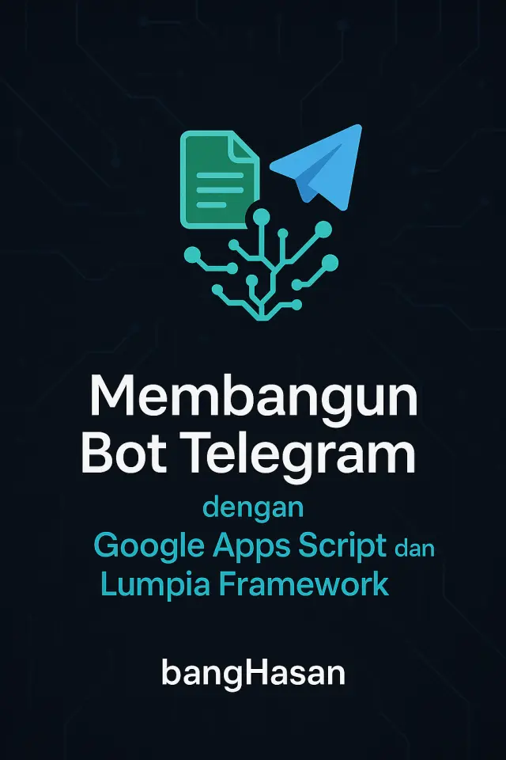

# Membangun Bot Telegram dengan Google Apps Script dan Lumpia Framework

**Dari Pemula Hingga Mahir**

| Metadata                 | Detail                                     |
| :----------------------- | :----------------------------------------- |
| **Penulis (Author)**     | Hasanudin H Syafaat                        |
| **Email**                | banghasan@gmail.com                        |
| **Diskusi (Discussion)** | [@botIndonesia](https://t.me/botIndonesia) |
| **Tanggal Publikasi**    | 29 November 2025                           |

---



## Daftar Isi

- [Bab 1: Pendahuluan - Mengapa GAS dan Lumpia?](#bab-1-pendahuluan---mengapa-gas-dan-lumpia)
  - [1.1 Latar Belakang](#11-latar-belakang)
  - [1.2 Untuk Siapa Buku Ini?](#12-untuk-siapa-buku-ini)
    - [🎯 Pemula Absolut (Belum Pernah Coding)](#-pemula-absolut-belum-pernah-coding)
    - [💡 Pemula dengan Pengetahuan Dasar Programming](#-pemula-dengan-pengetahuan-dasar-programming)
    - [🚀 Developer Berpengalaman](#-developer-berpengalaman)
  - [1.3 Apa Itu Bot Telegram?](#13-apa-itu-bot-telegram)
  - [1.4 Mengapa Google Apps Script (GAS)?](#14-mengapa-google-apps-script-gas)
    - [Limitasi Penggunaan Google Apps Script](#limitasi-penggunaan-google-apps-script)
  - [1.5 Mengenal Lumpia Framework (TelegramBotIndonesia Library)](#15-mengenal-lumpia-framework-telegrambotindonesia-library)
  - [1.6 Apa yang Perlu Dipersiapkan?](#16-apa-yang-perlu-dipersiapkan)
    - [✅ Akun dan Akses](#-akun-dan-akses)
    - [🛠️ Pengetahuan Dasar (Opsional tapi Direkomendasikan)](#️-pengetahuan-dasar-opsional-tapi-direkomendasikan)
    - [📋 Checklist Persiapan Teknis](#-checklist-persiapan-teknis)
    - [💡 Tips Sebelum Memulai](#-tips-sebelum-memulai)

- [Bab 2: Persiapan Awal - BotFather dan GAS](#bab-2-persiapan-awal---botfather-dan-gas)
  - [2.1 Langkah 1: Mendapatkan Token Bot dari BotFather](#21-langkah-1-mendapatkan-token-bot-dari-botfather)
  - [2.2 Langkah 2: Membuat Proyek Google Apps Script](#22-langkah-2-membuat-proyek-google-apps-script)
  - [2.3 Langkah 3: Menambahkan Lumpia Framework (Library)](#23-langkah-3-menambahkan-lumpia-framework-library)

- [Bab 3: Bot Pertama Anda - Hello World](#bab-3-bot-pertama-anda---hello-world)
  - [3.1 Struktur Kode Dasar](#31-struktur-kode-dasar)
    - [3.1.1 Fungsi `doPost(e)`](#311-fungsi-doposte)
    - [3.1.2 Inisiasi Bot](#312-inisiasi-bot)
  - [3.2 Menambahkan Handler Perintah](#32-menambahkan-handler-perintah)
  - [3.3 Deployment dan Webhook](#33-deployment-dan-webhook)
    - [3.3.1 Deployment (Penerbitan)](#331-deployment-penerbitan)
    - [3.3.2 Set Webhook](#332-set-webhook)

- [Bab 4: Fitur Menengah - Context dan Keyboard](#bab-4-fitur-menengah---context-dan-keyboard)
  - [4.1 Objek Context (`ctx`)](#41-objek-context-ctx)
  - [4.2 Keyboard Kustom](#42-keyboard-kustom)
    - [4.2.1 Reply Keyboard (Keyboard Balasan)](#421-reply-keyboard-keyboard-balasan)
    - [4.2.2 Inline Keyboard (Keyboard Sebaris)](#422-inline-keyboard-keyboard-sebaris)

- [Bab 5: Fitur Mahir - Middleware dan Integrasi GAS](#bab-5-fitur-mahir---middleware-dan-integrasi-gas)
  - [5.1 Middleware: Memproses Pesan Sebelum Handler](#51-middleware-memproses-pesan-sebelum-handler)
  - [5.2 Manajemen Sesi (State Management)](#52-manajemen-sesi-state-management)
  - [5.3 Integrasi dengan Google Sheets](#53-integrasi-dengan-google-sheets)
    - [Integrasi dengan miniSheetDBv2](#integrasi-dengan-minisheetdbv2)

- [Penutup dan Sumber Daya Lanjutan](#penutup-dan-sumber-daya-lanjutan)
  - [Ringkasan Pembelajaran](#ringkasan-pembelajaran)
  - [Sumber Daya Lanjutan](#sumber-daya-lanjutan)

- [Referensi](#referensi)

---

## Bab 1: Pendahuluan - Mengapa GAS dan Lumpia?

Selamat datang di panduan komprehensif untuk membangun bot Telegram yang kuat
dan fungsional menggunakan **Google Apps Script (GAS)** dan **Lumpia Framework**
(dikenal juga sebagai TelegramBotIndonesia Library v3) [^1]. Tulisan ini
dirancang untuk membawa Anda dari nol, bahkan jika Anda belum pernah menyentuh
kode sebelumnya, hingga mampu menciptakan bot dengan fitur-fitur canggih.

### 1.1 Latar Belakang

Di era digital saat ini, otomasi dan interaksi berbasis chat menjadi semakin
penting. Bot Telegram telah menjadi solusi populer untuk berbagai kebutuhan,
mulai dari layanan pelanggan, notifikasi otomatis, hingga sistem informasi
interaktif. Namun, banyak pengembang pemula menghadapi kendala dalam membangun
bot karena:

1. **Biaya Hosting**: Kebanyakan tutorial bot memerlukan server berbayar atau
   VPS yang tidak terjangkau untuk pemula atau proyek skala kecil.
2. **Kompleksitas Teknis**: Berinteraksi langsung dengan Telegram Bot API [^3]
   memerlukan pemahaman mendalam tentang HTTP requests, webhook, dan penanganan
   JSON yang rumit.
3. **Keterbatasan Sumber Daya**: Tidak semua orang memiliki akses ke
   infrastruktur cloud atau pengetahuan DevOps untuk deployment.

Google Apps Script hadir sebagai solusi yang mengatasi semua kendala tersebut.
Dengan infrastruktur Google yang gratis dan andal, serta Lumpia Framework yang
menyederhanakan kompleksitas API, siapa pun dapat membangun bot Telegram
profesional tanpa biaya hosting dan dengan kurva pembelajaran yang lebih landai.

### 1.2 Untuk Siapa Buku Ini?

Buku ini dirancang dengan pendekatan bertahap untuk mengakomodasi berbagai
tingkat keahlian:

#### 🎯 Pemula Absolut (Belum Pernah Coding)

Jika Anda belum pernah menulis kode sebelumnya, jangan khawatir! Buku ini akan
memandu Anda langkah demi langkah, dimulai dari konsep paling dasar. 

```admonish title="Anda akan belajar"

- Cara mendapatkan token bot dari BotFather
- Memahami struktur kode JavaScript sederhana
- Membuat bot pertama yang dapat merespons perintah dasar
- Konsep fundamental seperti variabel, fungsi, dan objek
```

#### 💡 Pemula dengan Pengetahuan Dasar Programming

Jika Anda sudah familiar dengan konsep dasar programming (variabel, fungsi,
kondisional).

```admonish summary title="Poin"
- Bisa melewati penjelasan konsep dasar dan fokus pada implementasi
- Langsung memahami struktur handler dan middleware
- Mengeksplorasi fitur-fitur menengah seperti keyboard interaktif dan manajemen
  sesi
```

#### 🚀 Developer Berpengalaman

Bagi Anda yang sudah terbiasa dengan JavaScript atau framework bot lain (seperti
Telegraf, python-telegram-bot), buku ini akan membantu Anda:

```admonish title="Hal-hal"
- Memahami perbedaan dan keunikan Google Apps Script
- Memanfaatkan integrasi ekosistem Google (Sheets, Drive, Gmail)
- Mengoptimalkan bot dengan middleware dan arsitektur yang scalable
- Mengatasi limitasi GAS dengan teknik-teknik advanced
```

### 1.3 Apa Itu Bot Telegram?

Bot Telegram adalah akun khusus yang tidak memerlukan nomor telepon tambahan
untuk disiapkan. Bot ini berfungsi sebagai antarmuka terprogram yang
memungkinkan pengguna berinteraksi dengan layanan eksternal melalui aplikasi
Telegram. Bot dapat melakukan berbagai tugas, seperti mengirim pesan, gambar,
dan file, mengelola grup, hingga berintegrasi dengan database atau layanan web
lainnya.

### 1.4 Mengapa Google Apps Script (GAS)?

Google Apps Script adalah platform pengembangan berbasis JavaScript yang
memungkinkan Anda mengotomatisasi, mengintegrasikan, dan memperluas produk
Google seperti Google Sheets, Docs, dan Drive.

Ada beberapa alasan kuat mengapa GAS menjadi pilihan ideal untuk hosting bot
Telegram, terutama bagi pemula:

1. **Gratis dan Tanpa Server:** Anda tidak perlu menyewa _Virtual Private
   Server_ (VPS) atau layanan _cloud_ berbayar. GAS berjalan di infrastruktur
   Google secara gratis (dengan batasan harian yang sangat besar untuk
   penggunaan pribadi).
2. **Integrasi Google yang Mudah:** Bot Anda dapat dengan mudah membaca dan
   menulis data ke Google Sheets, mengirim email melalui Gmail, atau mengelola
   file di Google Drive.
3. **Kemudahan Deployment:** Proses _deployment_ bot Telegram di GAS sangat
   sederhana, hanya dengan mempublikasikan skrip sebagai aplikasi web (_Web
   App_).

#### Limitasi Penggunaan Google Apps Script

Di balik kemudahannya, GAS memiliki kuota dan batas teknis yang perlu diingat
agar bot tetap andal:

- **Durasi Eksekusi:** Setiap pemanggilan fungsi (termasuk `doPost`) dibatasi
  sekitar 6 menit untuk akun individu; jika logika bot terlalu berat, eksekusi
  akan dihentikan otomatis.
- **Total Waktu Harian:** Jumlah total runtime skrip dibatasi ±90 menit per hari
  untuk akun standar, sehingga lonjakan trafik dapat menghentikan bot hingga
  kuota direset.
- **Permintaan Eksternal:** Kuota `UrlFetchApp` (metode yang digunakan Lumpia
  untuk memanggil Telegram API) sekitar 20.000 permintaan per hari; melebihi
  angka ini akan menimbulkan error `Exception: Service invoked too many times`.
- **Respon dan Payload:** Ukuran respons Web App dibatasi ±50 MB dan ukuran
  request POST dibatasi agar server GAS tetap stabil; kiriman file besar tidak
  akan diterima.

Jika kebutuhan proyek melampaui batas tersebut, pertimbangkan untuk memecah
beban kerja, menggunakan cache, atau memigrasikan bot ke platform serverless
lain. Detail kuota selalu diperbarui dalam dokumentasi resmi Google Apps Script
[^5].

### 1.5 Mengenal Lumpia Framework (TelegramBotIndonesia Library)

Meskipun Telegram menyediakan API yang kuat, berinteraksi langsung dengannya
menggunakan GAS bisa menjadi rumit. Di sinilah **Lumpia Framework** berperan.

Lumpia Framework adalah _wrapper_ atau pustaka pihak ketiga yang dibuat khusus
untuk Google Apps Script, menyederhanakan interaksi dengan Telegram Bot API.
Dengan Lumpia, Anda dapat menulis kode bot yang lebih bersih, terstruktur, dan
mudah dipelihara, mirip dengan _framework_ bot populer lainnya seperti Telegraf
atau Node-Telegram-Bot-API.

**Keunggulan Utama Lumpia:**

- **Penanganan Update yang Mudah:** Lumpia menyediakan _middleware_ dan
  _handler_ yang intuitif untuk merespons berbagai jenis pesan (perintah, teks,
  gambar, dll.).
- **Context Object (ctx):** Setiap pembaruan pesan dibungkus dalam objek `ctx`
  yang kaya informasi, memungkinkan Anda merespons dengan cepat dan mengakses
  data pesan dengan mudah.
- **Dukungan Penuh Fitur Telegram:** Mulai dari _Inline Keyboard_, _Reply
  Keyboard_, hingga manajemen sesi, semua didukung dengan baik.

Materi lengkap dan videonya tersedia pada situs
[Lumpia Framework](https://lumpia.js.org/)

### 1.6 Apa yang Perlu Dipersiapkan?

Sebelum memulai perjalanan membangun bot Telegram, pastikan Anda telah
menyiapkan hal-hal berikut:

#### ✅ Akun dan Akses

1. **Akun Telegram Aktif**
   - Pastikan Anda memiliki aplikasi Telegram yang terinstal di smartphone atau
     desktop
   - Akun harus dapat mengakses @BotFather untuk membuat bot baru

2. **Akun Google**
   - Diperlukan untuk mengakses Google Apps Script
   - Pastikan Anda dapat login ke Google Drive
   - Tidak memerlukan akun berbayar, akun Gmail gratis sudah cukup

#### 🛠️ Pengetahuan Dasar (Opsional tapi Direkomendasikan)

1. **Pemahaman JavaScript Dasar**
   - Variabel dan tipe data
   - Fungsi dan arrow function (`=>`)
   - Objek dan array
   - _Jika belum familiar, jangan khawatir! Buku ini akan menjelaskan setiap
     konsep yang digunakan._

2. **Konsep HTTP dan API (Akan Dipelajari)**
   - Anda tidak perlu memahami ini sebelumnya
   - Buku ini akan menjelaskan konsep webhook dan API secara bertahap

#### 📋 Checklist Persiapan Teknis

Sebelum masuk ke Bab 2, pastikan Anda sudah:

- [ ] Memiliki akses ke aplikasi Telegram
- [ ] Dapat login ke Google Drive dengan akun Google Anda
- [ ] Memiliki koneksi internet yang stabil
- [ ] Menyiapkan browser modern (Chrome, Firefox, Edge, atau Safari)
- [ ] Menyiapkan text editor atau notepad untuk mencatat token dan URL
      (opsional)

#### 💡 Tips Sebelum Memulai

```admonish tip title="Untuk Pemula"
 Jangan terburu-buru. Ikuti setiap langkah dengan teliti dan
 jangan ragu untuk mencoba kode berkali-kali. Kesalahan adalah bagian dari
 proses belajar!
```

```admonish info title="Untuk Developer Berpengalaman"
Meskipun Anda familiar dengan JavaScript,
 perhatikan perbedaan dan limitasi Google Apps Script dibandingkan dengan
 Node.js atau environment JavaScript lainnya.
```

```admonish quote title="Untuk Semua"
Simpan token bot Anda dengan aman dan jangan pernah
 membagikannya di tempat publik (GitHub, forum, dll). Token adalah kunci penuh
 kontrol atas bot Anda.
```

---

## Bab 2: Persiapan Awal - BotFather dan GAS

Sebelum menulis kode, ada dua hal penting yang harus Anda siapkan: token bot
dari Telegram dan proyek Google Apps Script.


### 2.1 Langkah 1: Mendapatkan Token Bot dari BotFather

**BotFather** adalah bot resmi Telegram yang digunakan untuk membuat dan
mengelola bot-bot lainnya.

1. Buka aplikasi Telegram Anda dan cari **@BotFather**.
2. Ketik perintah `/newbot` dan ikuti instruksi.
3. Pilih nama untuk bot Anda (misalnya, "Bot Ebook Saya").
4. Pilih _username_ untuk bot Anda (harus diakhiri dengan "bot", misalnya,
   "ebook_bot_saya_bot").
5. Setelah berhasil, BotFather akan memberikan Anda **HTTP API Token**. Simpan
   token ini dengan aman, karena ini adalah kunci untuk mengontrol bot Anda.

```admonish danger title="Peringatan"
**Penting:** Token bot Anda akan terlihat seperti ini:
`123456789:ABC-DEF1234ghIkl-Jkl-Lmn-Opq-Rst-Uvwxyz`.
**JANGAN** pernah membagikan token ini kepada siapapun.
```

### 2.2 Langkah 2: Membuat Proyek Google Apps Script

1. Buka **Google Drive** Anda.
2. Klik **Baru** -> **Lainnya** -> **Google Apps Script**. Ini akan membuka
   editor GAS baru.
3. Beri nama proyek Anda (misalnya, "TelegramBotLumpia").

### 2.3 Langkah 3: Menambahkan Lumpia Framework (Library)

Lumpia Framework ditambahkan ke proyek GAS Anda sebagai _Library_ eksternal.

1. Di editor GAS, klik ikon **Libraries** (biasanya ikon buku di panel kiri).
2. Di bagian "Add a library", masukkan **ID Library** Lumpia Framework:
   `1Yo6vQRwjG5Gl9jeEF0g2tBTUa0XN5MyT4G_HeDpRr9DvabxhRcSdhPNj`[^2]
3. Klik **Look up**.
4. Pilih versi terbaru (disarankan versi stabil, biasanya angka terbesar).
5. Pastikan _Identifier_ adalah `lumpia` (ini adalah nama variabel yang akan
   Anda gunakan dalam kode).
6. Klik **Add**.


Sekarang, proyek Anda sudah siap untuk menerima kode bot.

---

## Bab 3: Bot Pertama Anda - Hello World

Di bab ini, kita akan membuat bot paling dasar yang dapat merespons perintah
`/start` dan `/ping`.

### 3.1 Struktur Kode Dasar

Setiap bot Telegram yang di-host di Google Apps Script harus memiliki dua
komponen utama: fungsi `doPost(e)` dan inisiasi bot.

#### 3.1.1 Fungsi `doPost(e)`

Fungsi ini adalah _entry point_ (titik masuk) untuk semua komunikasi dari
Telegram ke bot Anda. Ketika pengguna mengirim pesan, Telegram akan mengirimkan
data pesan tersebut ke URL Web App Anda melalui metode HTTP POST. Data ini
diterima oleh GAS dalam parameter `e`.

```javascript
// handle komunikasi via POST dari Telegram ke (webhook) GAS
function doPost(e) {
  bot.doPost(e);
}
```

#### 3.1.2 Inisiasi Bot

Anda perlu menginisiasi Lumpia Framework dengan token bot Anda.

```javascript
// Ganti dengan token bot Anda yang sebenarnya
const token = "TOKEN_BOT_ANDA_DI_SINI";

// Inisiasi Lumpia Framework
const bot = new lumpia.init(token);
```

### 3.2 Menambahkan Handler Perintah

Lumpia Framework menggunakan konsep _handler_ untuk merespons berbagai jenis
pesan.

| Metode Handler               | Deskripsi                                                         | Contoh Penggunaan                                     |
| :--------------------------- | :---------------------------------------------------------------- | :---------------------------------------------------- |
| `bot.start(callback)`        | Merespons perintah `/start`.                                      | `bot.start(ctx => ctx.reply('Selamat datang!'));`     |
| `bot.cmd(command, callback)` | Merespons perintah kustom (misalnya, `/ping`).                    | `bot.cmd('ping', ctx => ctx.replyIt('Pong!'));`       |
| `bot.hears(regex, callback)` | Merespons pesan teks yang cocok dengan pola _regular expression_. | `bot.hears(/halo/i, ctx => ctx.reply('Halo juga!'));` |

#### Kode Lengkap Bot Pertama


```javascript
// Ganti dengan token bot Anda yang sebenarnya
const token = "TOKEN_BOT_ANDA_DI_SINI";

// Inisiasi Lumpia Framework
const bot = new lumpia.init(token);

// 1. Handler untuk perintah /start
bot.start((ctx) => {
  // ctx.reply() adalah metode cepat untuk membalas pesan
  ctx.reply(
    "Halo! Saya adalah bot pertama Anda yang dibuat dengan Lumpia Framework.",
  );
});

// 2. Handler untuk perintah /ping
bot.cmd("ping", (ctx) => {
  // ctx.replyIt() adalah alias untuk ctx.reply()
  ctx.replyIt("Pong!");
});

// 3. Handler untuk pesan teks "apa kabar" (case insensitive)
bot.hears(/apa kabar/i, (ctx) => {
  ctx.reply("Saya baik, terima kasih sudah bertanya!");
});

// handle komunikasi via POST dari Telegram ke (webhook) GAS
function doPost(e) {
  bot.doPost(e);
}
```

### 3.3 Deployment dan Webhook

Setelah kode selesai, Anda perlu _mendeploy_ skrip sebagai Aplikasi Web dan
mengatur _webhook_ agar Telegram tahu ke mana harus mengirim pesan.

#### 3.3.1 Deployment (Penerbitan)

1. Di editor GAS, klik **Deploy** -> **New deployment**.
2. Pilih **Type** sebagai **Web app**.
3. Isi deskripsi (misalnya, "Versi 1.0").
4. Pada bagian **Execute as**, pilih **Me** (akun Anda).
5. Pada bagian **Who has access**, pilih **Anyone**.
6. Klik **Deploy**.
7. GAS akan memberikan Anda **Web app URL**. Salin URL ini.


```admonish warning title="Perhatian"
**Penting:** Saat pertama kali menjalankan fungsi yang mengakses layanan
Google (seperti `SpreadsheetApp`), GAS akan meminta Anda untuk memberikan izin
(_Authorization_). Anda harus menyetujui izin ini agar bot dapat berfungsi.
```

Petunjuk dalam gambar:


#### 3.3.2 Set Webhook

_Webhook_ adalah mekanisme di mana Telegram akan "memanggil" URL Web App Anda
setiap kali ada pesan baru.

Buat fungsi baru di GAS untuk mengatur _webhook_:

```javascript
function setWebHook() {
  // Ganti dengan URL Web App yang Anda dapatkan dari langkah deployment
  const webAppUrl = "URL_WEB_APP_ANDA_DI_SINI";

  // Lumpia menyediakan metode setWebhook yang mudah
  let result = bot.telegram.setWebhook(webAppUrl);

  // Tampilkan hasil di log untuk memastikan berhasil
  Logger.log(result);
}
```

1. Ganti `URL_WEB_APP_ANDA_DI_SINI` dengan URL Web App Anda.
2. Pilih fungsi `setWebHook` di menu _dropdown_ di atas editor kode.
3. Klik **Run**.
4. Periksa **Execution log** (Log Eksekusi) untuk memastikan hasilnya sukses.


Bot Anda sekarang sudah aktif! Coba kirim `/start` atau `/ping` di Telegram.

---

## Bab 4: Fitur Menengah - Context dan Keyboard

Setelah bot dasar Anda berjalan, mari kita jelajahi fitur-fitur Lumpia yang
lebih canggih.

### 4.1 Objek Context (`ctx`)

Setiap _handler_ (seperti `bot.cmd` atau `bot.hears`) menerima objek `ctx`
(_Context_) sebagai argumen. Objek ini adalah jantung dari Lumpia Framework,
berisi semua informasi tentang pesan yang masuk dan menyediakan metode cepat
untuk merespons.

| Properti/Metode `ctx` | Deskripsi                                                      |
| :-------------------- | :------------------------------------------------------------- |
| `ctx.update`          | Objek mentah dari Telegram API yang berisi seluruh data pesan. |
| `ctx.message`         | Objek pesan yang masuk.                                        |
| `ctx.from`            | Objek pengguna yang mengirim pesan.                            |
| `ctx.chat.id`         | ID unik dari obrolan (penting untuk mengirim balasan).         |
| `ctx.reply(text)`     | Metode cepat untuk membalas pesan.                             |
| `ctx.replyIt(text)`   | Alias dari `ctx.reply(text)`.                                  |
| `ctx.match`           | Hasil pencocokan dari `bot.hears` (jika menggunakan regex).    |

#### Contoh Penggunaan `ctx`

```javascript
bot.cmd("siapa", (ctx) => {
  const namaPengirim = ctx.from.first_name;
  const chatId = ctx.chat.id;

  ctx.reply(`Halo ${namaPengirim}! ID Chat Anda adalah ${chatId}.`);
});

// Contoh menangkap teks setelah perintah /say
bot.hears(/^\/say (.*)/i, (ctx) => {
  // ctx.match[1] berisi teks yang ditangkap oleh regex group pertama
  const teksYangDiucapkan = ctx.match[1];
  ctx.reply(`Anda mengatakan: ${teksYangDiucapkan}`);
});
```

### 4.2 Keyboard Kustom

Telegram mendukung dua jenis keyboard yang sangat berguna untuk interaksi
pengguna: _Reply Keyboard_ dan _Inline Keyboard_.

#### 4.2.1 Reply Keyboard (Keyboard Balasan)

Keyboard ini menggantikan keyboard bawaan Telegram dan sangat cocok untuk menu
utama.

```javascript
bot.cmd("menu", (ctx) => {
  const keyboard = [
    ["Pilihan A", "Pilihan B"],
    ["Bantuan", "Kembali ke Awal"],
  ];

  // Menggunakan metode replyKeyboard dari Lumpia
  ctx.reply("Silakan pilih menu:", lumpia.replyKeyboard(keyboard));
});

// Menangani respons dari tombol Reply Keyboard
bot.hears("Pilihan A", (ctx) => ctx.reply("Anda memilih Pilihan A."));
```

#### 4.2.2 Inline Keyboard (Keyboard Sebaris)

Keyboard ini muncul tepat di bawah pesan bot dan sangat cocok untuk aksi
spesifik. Ketika tombol _Inline Keyboard_ diklik, bot menerima _callback query_
alih-alih pesan teks.

```javascript
bot.cmd("aksi", (ctx) => {
  const inlineKeyboard = [
    [{ text: "Klik Saya", callback_data: "data_klik_saya" }],
    [{ text: "Kunjungi Google", url: "https://google.com" }],
  ];

  // Menggunakan metode inlineKeyboard dari Lumpia
  ctx.reply("Pilih aksi di bawah ini:", lumpia.inlineKeyboard(inlineKeyboard));
});

// Menangani Callback Query dari Inline Keyboard
bot.on("callback_query", (ctx) => {
  const data = ctx.update.callback_query.data;

  if (data === "data_klik_saya") {
    // Lumpia menyediakan ctx.answerCbQuery untuk notifikasi pop-up
    ctx.answerCbQuery("Tombol berhasil diklik!", true);

    // Mengedit pesan yang memiliki Inline Keyboard
    ctx.telegram.editMessageText(
      ctx.chat.id,
      ctx.update.callback_query.message.message_id,
      "Pesan ini sudah diubah setelah tombol diklik.",
    );
  }
});
```

---

## Bab 5: Fitur Mahir - Middleware dan Integrasi GAS

Di bab terakhir ini, kita akan membahas fitur-fitur yang akan membawa bot Anda
ke tingkat yang lebih profesional, termasuk manajemen sesi dan integrasi dengan
layanan Google.

### 5.1 Middleware: Memproses Pesan Sebelum Handler

_Middleware_ adalah fungsi yang dijalankan sebelum _handler_ utama Anda. Ini
sangat berguna untuk tugas-tugas seperti otentikasi, _logging_, atau manajemen
sesi. Lumpia menggunakan metode `bot.use(callback)` untuk menambahkan
_middleware_.

Setiap _middleware_ harus memanggil `next()` untuk meneruskan kontrol ke
_middleware_ atau _handler_ berikutnya.

#### Contoh Middleware untuk Logging

```javascript
// Middleware untuk mencatat setiap pesan yang masuk
bot.use((ctx, next) => {
  const user = ctx.from.first_name || "Pengguna";
  const pesan = ctx.message.text || "Non-teks";

  Logger.log(`[LOG] Pesan dari ${user}: ${pesan}`);

  // Lanjutkan ke handler berikutnya
  next();
});

// Handler ini hanya akan dijalankan setelah middleware logging selesai
bot.cmd("info", (ctx) => ctx.reply("Logging berhasil dilakukan."));
```

### 5.2 Manajemen Sesi (State Management)

Untuk membuat bot yang dapat melakukan percakapan multi-langkah (misalnya,
mengisi formulir), Anda perlu menyimpan _state_ atau sesi pengguna. Lumpia
Framework memfasilitasi ini melalui objek `ctx.session`.

Secara _default_, Lumpia menyimpan sesi di properti `ctx.session` yang dapat
Anda atur. Untuk menyimpan sesi secara persisten (misalnya, di Google Sheets
atau Cache Service), Anda perlu mengimplementasikan logika penyimpanan Anda
sendiri di _middleware_.

#### Contoh Sesi Sederhana (Menggunakan Properti `ctx.session`)

```javascript
// Middleware untuk inisiasi sesi (jika belum ada)
bot.use((ctx, next) => {
  // Lumpia secara otomatis menyediakan objek sesi
  if (!ctx.session) {
    ctx.session = {};
  }
  next();
});

bot.cmd("tanya", (ctx) => {
  ctx.session.state = "menunggu_nama"; // Atur state pengguna
  ctx.reply("Siapa nama Anda?");
});

// Handler untuk menangani pesan teks
bot.hears(/.*/, (ctx) => {
  if (ctx.session.state === "menunggu_nama") {
    const nama = ctx.message.text;
    ctx.session.nama = nama;
    ctx.session.state = "menunggu_usia";
    ctx.reply(`Halo, ${nama}. Berapa usia Anda?`);
  } else if (ctx.session.state === "menunggu_usia") {
    const usia = ctx.message.text;
    ctx.session.state = null; // Sesi selesai
    ctx.reply(`Terima kasih, ${ctx.session.nama}. Usia Anda ${usia} tahun.`);
  } else {
    // Balasan default jika tidak ada sesi aktif
    ctx.reply("Saya tidak mengerti. Ketik /tanya untuk memulai sesi.");
  }
});
```

> **Catatan:** Untuk bot yang kompleks, disarankan untuk mengintegrasikan
> manajemen sesi dengan **Google Sheets** atau **Cache Service** GAS agar data
> sesi tetap tersimpan meskipun bot di-deploy ulang.

### 5.3 Integrasi dengan Google Sheets

Salah satu kekuatan terbesar GAS adalah integrasinya dengan Google Sheets. Anda
dapat menggunakan bot Anda untuk mencatat data pengguna, membuat log, atau
bahkan berfungsi sebagai antarmuka database.

#### Contoh Mencatat Data ke Google Sheets

Asumsikan Anda memiliki Google Sheet dengan URL: `SHEET_URL_ANDA` dan nama
sheet: `Data Log`.

```javascript
// Fungsi untuk mencatat log ke Google Sheet
function logToSheet(data) {
  const sheetId = "ID_GOOGLE_SHEET_ANDA"; // Ambil ID dari URL Sheet
  const sheet = SpreadsheetApp.openById(sheetId).getSheetByName("Data Log");

  // Tambahkan baris baru dengan data
  sheet.appendRow(data);
}

bot.cmd("catat", (ctx) => {
  const timestamp = new Date();
  const userId = ctx.from.id;
  const username = ctx.from.username || "N/A";
  const messageText = ctx.message.text;

  // Data yang akan dicatat
  const dataLog = [timestamp, userId, username, messageText];

  try {
    logToSheet(dataLog);
    ctx.reply("Pesan Anda berhasil dicatat ke Google Sheet!");
  } catch (e) {
    ctx.reply(
      "Gagal mencatat data. Pastikan Anda sudah memberikan izin akses ke Google Sheet.",
    );
    Logger.log(e);
  }
});
```

#### Integrasi dengan miniSheetDBv2

Untuk mempermudah pengelolaan data di Google Sheet, Anda dapat mengintegrasikan
bot dengan Library
[miniSheetDBv2](https://github.com/telegrambotindonesia/miniSheetDBv2). Library
ini menyediakan abstraksi tingkat tinggi yang sangat menyederhanakan operasi
database menggunakan Google Sheets sebagai backend.

```admonish summary title="Rekomendasi"
Penulis sangat merekomendasikan penggunaan Library **miniSheetDBv2**[^miniSheetDBv2] karena beberapa alasan:

 - **Operasi CRUD yang Mudah**: Menyediakan metode sederhana untuk Create,
   Read, Update, dan Delete data tanpa perlu menulis kode `SpreadsheetApp` yang
   kompleks
 - **Penanganan Tipe Data Otomatis**: Secara otomatis mengkonversi data antara
   format JavaScript dan Google Sheets
 - **Query yang Fleksibel**: Mendukung pencarian dan filtering data dengan
   sintaks yang intuitif, mirip dengan database NoSQL
 - **Performa Optimal**: Menggunakan caching dan batch operations untuk
   mengurangi API calls dan mempercepat eksekusi
 - **Dokumentasi Lengkap**: Dilengkapi dengan contoh kode dan tutorial dalam
   Bahasa Indonesia
```

---

## Penutup dan Sumber Daya Lanjutan

Selamat! Anda telah mempelajari dasar-dasar hingga fitur mahir dalam membangun
bot Telegram menggunakan Google Apps Script dan Lumpia Framework.

### Ringkasan Pembelajaran

| Level        | Konsep Kunci                                 | Metode Lumpia yang Dipelajari                                                                                             |
| :----------- | :------------------------------------------- | :------------------------------------------------------------------------------------------------------------------------ |
| **Pemula**   | Setup GAS, Token Bot, Webhook                | `lumpia.init()`, `doPost(e)`, `bot.start()`, `bot.cmd()`, `ctx.reply()`                                                   |
| **Menengah** | Context, Regex, Keyboard Interaktif          | `ctx.from`, `ctx.chat.id`, `bot.hears()`, `lumpia.replyKeyboard()`, `lumpia.inlineKeyboard()`, `bot.on('callback_query')` |
| **Mahir**    | Percakapan Multi-langkah, Logging, Integrasi | `bot.use()`, `ctx.session`, Integrasi `SpreadsheetApp`                                                                    |

### Sumber Daya Lanjutan

Untuk terus mengembangkan kemampuan bot Anda, kami merekomendasikan sumber daya
berikut:

1. **Dokumentasi Resmi Lumpia Framework**[^1]: Selalu periksa dokumentasi resmi
   untuk metode dan fitur terbaru.
2. **Telegram Bot API Documentation**[^3]: Untuk memahami lebih dalam tentang
   struktur data yang dikirimkan oleh Telegram.
3. **Komunitas Telegram Bot Indonesia**[^4]: Bergabunglah dengan grup diskusi
   untuk bertanya dan berbagi pengalaman.


```admonish tip
Jangan lupa tonton video tutorialnya!

Guna memperjelas pemahaman dan _insight_ secara umum.
```



---

## Referensi

[^1]: [Lumpia Framework](https://lumpia.js.org/) _Dokumentasi Resmi Lumpia
    Framework_

[^2]: [GAS-Lib-v3 GitHub](https://github.com/telegrambotindonesia/GAS-Lib-v3)
    _Source Code Framework_

[^3]: [Telegram Bot API](https://core.telegram.org/bots/api) _Dokumentasi Resmi
    API Telegram_

[^4]: [Telegram Bot Indonesia](https://t.me/botIndonesia) _Grup Diskusi
    Telegram_

[^5]: [Google Apps Script Quotas](https://developers.google.com/apps-script/guides/services/quotas)
    _Daftar Batas Layanan dan Kuota GAS Terbaru_

[^miniSheetDBv2]: [miniSheetDBv2](https://github.com/telegrambotindonesia/miniSheetDBv2)
    _Library untuk integrasi Google Sheet dengan GAS_
