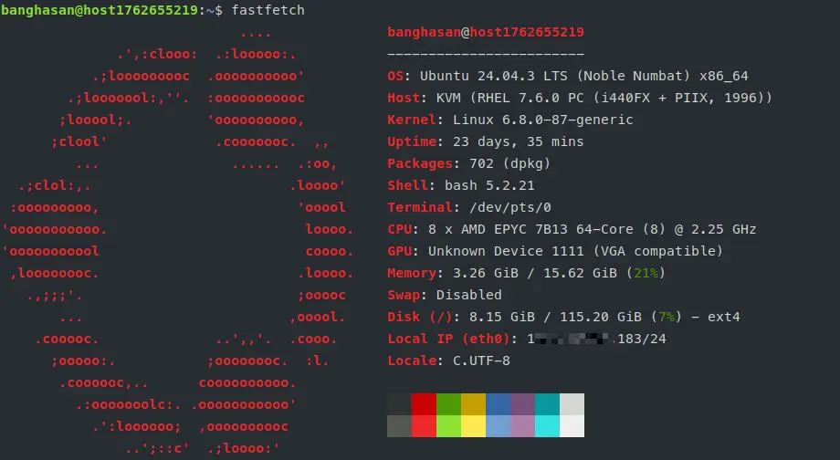
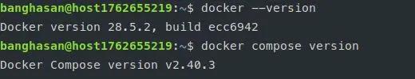

# Panduan Setup VPS untuk Pemula

## Daftar Isi

- [Apa itu VPS?](#apa-itu-vps)
- [Kegunaan dan Fungsi VPS](#kegunaan-dan-fungsi-vps)
- [Perbedaan VPS dengan Hosting Lainnya](#perbedaan-vps-dengan-hosting-lainnya)
- [Kapan kamu Membutuhkan VPS?](#kapan-kamu-membutuhkan-vps)
- [Panduan Setup VPS Pertama Kali](#panduan-setup-vps-pertama-kali)
  - [1. Akses VPS Pertama Kali](#1-akses-vps-pertama-kali)
  - [2. Update dan Upgrade Sistem](#2-update-dan-upgrade-sistem)
  - [3. Membuat User Baru (Non-Root)](#3-membuat-user-baru-non-root)
  - [4. Konfigurasi SSH untuk Keamanan](#4-konfigurasi-ssh-untuk-keamanan)
  - [5. Disable Root Login](#5-disable-root-login)
  - [6. Setup Firewall (UFW)](#6-setup-firewall-ufw)
  - [7. Install Software Dasar](#7-install-software-dasar)
  - [8. Konfigurasi Timezone](#8-konfigurasi-timezone)
  - [9. Setup Fail2Ban](#9-setup-fail2ban)
  - [10. Monitoring Sistem](#10-monitoring-sistem)
  - [11. Menggunakan Screen](#11-menggunakan-screen)
- [Tips Keamanan Tambahan](#tips-keamanan-tambahan)
- [Troubleshooting Umum](#troubleshooting-umum)
- [Kesimpulan](#kesimpulan)
- [Referensi](#referensi)

---

## ☁️ Apa Itu VPS?

**VPS** adalah singkatan dari **Virtual Private Server**, yang secara harfiah berarti "Server Pribadi Virtual." VPS adalah metode *hosting* yang membagi satu *server* fisik yang kuat menjadi beberapa mesin virtual yang terisolasi dan independen.

Kamu bisa membayangkan konsep ini sebagai sebuah **apartemen** di dalam gedung besar:

| Komponen | Analoginya | Fungsi |
| :--- | :--- | :--- |
| **Server Fisik** | Gedung Apartemen | *Hardware* fisik yang sangat besar (CPU, RAM, *Storage*) yang dimiliki oleh penyedia *hosting*. |
| **VPS** | Unit Apartemen Pribadi | Mesin virtual yang diisolasi di dalam *server* fisik. **Resource** kamu dijamin hanya untuk kamu. |
| **Teknologi Virtualisasi** | Dinding dan Pintu Unit | Teknologi (seperti KVM) yang memastikan sumber daya dan aktivitas satu VPS **tidak akan mengganggu** VPS lain. |


---

## ✨ Fitur Utama dan Manfaat VPS

1. **Virtual (Terbagi)**

    VPS adalah *software* yang berjalan di atas *hardware* fisik, tetapi karena teknologi virtualisasi, VPS berfungsi penuh layaknya *server* fisik yang terpisah. Ini memungkinkan pembagian *resource* fisik secara efisien.

2. **Private (Pribadi dan Terisolasi)**

    * **Akses *Root* Penuh:** Kamu mendapatkan akses *root* atau administrator penuh. Ini berarti kamu memiliki **kontrol penuh** untuk menginstal Sistem Operasi, *software*, dan mengkonfigurasi *firewall* (seperti UFW) sesuai kebutuhan kamu.
    
    * **Isolasi *Resource*:** Sumber daya yang dialokasikan (misalnya


---

## Kegunaan dan Fungsi VPS

1. **Hosting Website dan Aplikasi Web**

- Menjalankan website dengan traffic tinggi
- Hosting multiple websites
- Aplikasi web yang membutuhkan konfigurasi khusus

2. **Development dan Testing**

- Environment untuk development
- Testing aplikasi sebelum production
- CI/CD pipelines

3. **Database Server**

- MySQL, PostgreSQL, MongoDB
- Isolated database environment
- Backup dan recovery control

4. **Application Server**

- API servers
- Microservices
- Backend applications (Node.js, Python, Go, dll)

5. **Bot dan Automation**

- Telegram bots
- Discord bots
- Web scraping
- Scheduled tasks (cron jobs)

6. **Game Server**

- Minecraft server
- Counter-Strike server
- Private game servers

7. **VPN Server**

- Private VPN untuk keamanan
- Bypass geo-restrictions
- Secure remote access

8. **Mail Server**

- Email server pribadi
- Mailing list management

9. **File Storage dan Backup**

- Cloud storage pribadi (Nextcloud)
- Backup server
- File sharing

10. **Learning dan Eksperimen**

- Belajar Linux administration
- Eksperimen dengan teknologi baru
- Practice DevOps

---

## Perbedaan VPS dengan Hosting Lainnya

**🆚 Komparasi: VPS vs. Shared Hosting**

| Fitur | VPS (Virtual Private Server) | Shared Hosting |
| :--- | :--- | :--- |
| **Definisi** | Satu server fisik dibagi menjadi beberapa mesin virtual yang **terisolasi** secara mandiri. | Satu server fisik dibagi dan digunakan **bersama** oleh ratusan pengguna. |
| **Isolasi Sumber Daya** | **Tinggi.** Sumber daya (CPU, RAM, *disk*) **dijamin** dan didedikasikan hanya untuk kamu. | **Rendah.** Sumber daya dibagi. Kinerja kamu dapat terpengaruh oleh *traffic* pengguna lain (*bad neighbor effect*). |
| **Akses & Kontrol** | **Penuh (Akses *Root*/Admin).** Kamu memiliki kontrol penuh atas sistem operasi, *software*, *firewall*, dan konfigurasi. | **Terbatas.** Kamu hanya dapat mengelola *file* dan *database* melalui panel kontrol (cPanel/Plesk). |
| **Kinerja & Stabilitas** | **Sangat Baik.** Kinerja lebih stabil dan konsisten karena *resource* dijamin. | **Biasa.** Kinerja dapat berfluktuasi saat server ramai (*peak hours*). |
| **Keamanan** | **Tinggi.** Kamu bertanggung jawab penuh atas keamanan (*firewall*, *patching*), dan VPS kamu terisolasi dari pengguna lain. | **Menengah.** Keamanan diurus oleh penyedia *hosting*, tetapi kerentanan satu pengguna dapat memengaruhi pengguna lain di *server* yang sama. |
| **Kustomisasi** | **Penuh.** Kamu bebas menginstal *stack* (misalnya Node.js, Python, Java), konfigurasi *server* web (Nginx, Apache), dan sistem operasi pilihan. | **Terbatas.** Hanya *software* yang sudah terinstal oleh penyedia *hosting* yang dapat digunakan (umumnya PHP/MySQL). |
| **Skalabilitas** | **Mudah ditingkatkan (*Upgradable*).** Kamu dapat dengan mudah menambah RAM, CPU, atau *disk space* sesuai kebutuhan. | **Terbatas.** Peningkatan hanya sebatas paket yang ditawarkan oleh penyedia *hosting*. |
| **Harga** | **Menengah.** Lebih mahal daripada *Shared Hosting*, tetapi menawarkan nilai yang jauh lebih baik. | **Paling Murah.** Pilihan paling ekonomis. |
| **Target Pengguna** | Aplikasi yang tumbuh, *website* *e-commerce*, *developer*, *traffic* menengah ke atas, atau layanan yang membutuhkan **lingkungan khusus**. | *Website* pribadi, *blog* baru, atau *project* kecil dengan *traffic* sangat rendah. |

---

## Kapan kamu Membutuhkan VPS?

kamu membutuhkan VPS jika:

✅ Website kamu mulai lambat di shared hosting\
✅ Membutuhkan software/library khusus yang tidak tersedia di shared hosting\
✅ Ingin menjalankan aplikasi 24/7 (bot, scraper, dll)\
✅ Membutuhkan kontrol penuh atas server configuration\
✅ Traffic website meningkat signifikan\
✅ Membutuhkan multiple IP addresses\
✅ Ingin belajar server administration\
✅ Membutuhkan environment development yang mirip production

---
## Kesimpulan Ringkas

Jika kamu membutuhkan **kontrol penuh, kinerja stabil, dan fleksibilitas** untuk menjalankan aplikasi yang unik atau *website* dengan *traffic* yang signifikan, **VPS** adalah pilihan yang lebih tepat.

Jika kamu baru memulai dan membutuhkan solusi yang **paling murah dan mudah** tanpa memerlukan konfigurasi khusus, **Shared Hosting** adalah pilihan awal yang baik.

> [!TIP]
> Jika kamu butuh VPS murah meriah dan sudah teruji pemakaiannya, cek webnya [banghasan.com](https://banghasan.com)[^banghasan]
>
> Tidak sampai 200 ribu **per TAHUN** bisa untuk belajar, uji coba, produksi dan kebutuhan lainnya. Apalagi *hanya* untuk bot Telegram.
---


## Panduan Setup VPS Pertama Kali

Panduan ini menggunakan **Ubuntu 24.04 LTS** sebagai contoh, namun sebagian
besar perintah juga berlaku untuk distro Linux lainnya.

### 1. Akses VPS Pertama Kali

Setelah membeli VPS, kamu akan mendapatkan:

- IP Address
- Username (biasanya `root`)
- Password atau SSH key

#### Login via SSH

```bash
ssh root@IP_ADDRESS_VPS
```

Contoh:

```bash
ssh root@192.168.1.100
```

Jika menggunakan SSH key:

```bash
ssh -i /path/to/private_key root@IP_ADDRESS_VPS
```

> **💡 Tip:** Jika pertama kali connect, kamu akan diminta konfirmasi
> fingerprint. Ketik `yes`.

---

### 2. Update dan Upgrade Sistem

Langkah pertama yang **WAJIB** dilakukan adalah update sistem:

```bash
# Update package list
apt update

# Upgrade semua package
apt upgrade -y

# Upgrade distribusi (opsional)
apt dist-upgrade -y

# Hapus package yang tidak diperlukan
apt autoremove -y

# Bersihkan cache
apt autoclean
```

> **⚠️ Penting:** Selalu update sistem secara berkala untuk patch keamanan!

---

### 3. Membuat User Baru (Non-Root)

**Jangan pernah** menggunakan root untuk operasi sehari-hari. Buat user baru:

```bash
# Buat user baru (ganti 'namauser' dengan username kamu)
adduser namauser

# Tambahkan user ke grup sudo
usermod -aG sudo namauser
```

kamu akan diminta mengisi:

- Password (pilih password yang kuat!)
- Full Name (opsional)
- Room Number, dll (bisa di-skip dengan Enter)

#### Test User Baru

```bash
# Switch ke user baru
su - namauser

# Test sudo access
sudo apt update
```

---

### 4. Konfigurasi SSH untuk Keamanan

#### A. Setup SSH Key Authentication (Sangat Direkomendasikan)

**Di komputer lokal kamu** (bukan di VPS):

```bash
# Generate SSH key pair (jika belum punya)
ssh-keygen -t ed25519 -C "email@example.com"

# Copy public key ke VPS
ssh-copy-id namauser@IP_ADDRESS_VPS
```

Atau manual:

```bash
# Di komputer lokal, lihat public key
cat ~/.ssh/id_ed25519.pub
```

Copy output-nya, lalu **di VPS**:

```bash
# Login sebagai user baru
su - namauser

# Buat direktori .ssh
mkdir -p ~/.ssh
chmod 700 ~/.ssh

# Buat file authorized_keys
nano ~/.ssh/authorized_keys
# Paste public key kamu, save (Ctrl+X, Y, Enter)

# Set permission
chmod 600 ~/.ssh/authorized_keys
```

#### B. Mengganti Port SSH (Keamanan Tambahan)

Mengganti port SSH dari default (22) ke port lain dapat mengurangi serangan
brute-force otomatis. Ini adalah salah satu bentuk **security through
obscurity** - bukan solusi utama, tapi lapisan keamanan tambahan yang efektif.

**Tujuan penggantian port SSH:**

- 🛡️ Mengurangi serangan bot otomatis yang menargetkan port 22
- 📉 Mengurangi spam di log server
- 🔒 Lapisan keamanan tambahan (bukan pengganti password/key yang kuat)
- 🎯 Membuat server lebih "tersembunyi" dari scanner otomatis

**Langkah-langkah:**

```bash
# Backup konfigurasi original
sudo cp /etc/ssh/sshd_config /etc/ssh/sshd_config.backup

# Edit konfigurasi SSH
sudo nano /etc/ssh/sshd_config
```

Ubah/tambahkan setting berikut:

```bash
# Ubah port SSH (pilih port antara 1024-65535, hindari port umum)
Port 2222

# Disable empty passwords
PermitEmptyPasswords no

# Limit authentication attempts
MaxAuthTries 3

# Disable X11 forwarding (jika tidak dibutuhkan)
X11Forwarding no
```

**PENTING untuk Ubuntu 24.04:** Sejak Ubuntu 24.04, SSH menggunakan socket
systemd. kamu juga harus mengubah port di file socket:

```bash
# Edit SSH socket configuration
sudo nano /lib/systemd/system/ssh.socket
```

Cari baris `ListenStream=22` dan ubah menjadi:

```conf
[Socket]
ListenStream=2222
Accept=no
```

Reload systemd dan restart SSH:

```bash
# Reload systemd daemon
sudo systemctl daemon-reload

# Restart SSH socket
sudo systemctl restart ssh.socket

# Restart SSH service
sudo systemctl restart sshd

# Verify SSH is listening on new port
sudo ss -tulpn | grep 2222
```

> **⚠️ PERINGATAN:** Sebelum logout, test koneksi SSH di terminal baru dengan
> port baru!

Test koneksi baru (jangan logout dari session lama dulu):

```bash
# Di terminal baru
ssh -p 2222 namauser@IP_ADDRESS_VPS
```

Jika berhasil, kamu bisa lanjut ke hardening SSH.

#### C. Hardening SSH Configuration

Setelah yakin SSH key berfungsi, tambahkan keamanan ekstra:

```bash
sudo nano /etc/ssh/sshd_config
```

Tambahkan/ubah:

```bash
# Hanya izinkan user tertentu (opsional)
AllowUsers namauser

# Disable password authentication (hanya jika sudah setup SSH key!)
PasswordAuthentication no

# Disable challenge-response passwords
KbdInteractiveAuthentication no
```

Restart SSH:

```bash
sudo systemctl restart sshd
```

---

### 5. Disable Root Login

Setelah berhasil login dengan akun baru dan memastikan akun tersebut memiliki
akses sudo, **disable login root** untuk keamanan maksimal.

```bash
# Edit SSH config
sudo nano /etc/ssh/sshd_config
```

Ubah baris berikut:

```bash
# Disable root login
PermitRootLogin no
```

Restart SSH service:

```bash
sudo systemctl restart sshd
```

> **⚠️ PENTING:** Pastikan kamu sudah:
>
> 1. Membuat user baru dengan akses sudo
> 2. Berhasil login dengan user baru
> 3. Test sudo berfungsi dengan baik
>
> Jangan disable root login sebelum memastikan hal di atas, atau kamu bisa
> terkunci dari server!

Test di terminal baru:

```bash
# Ini seharusnya DITOLAK
ssh root@IP_ADDRESS_VPS

# Ini seharusnya BERHASIL
ssh -p 2222 namauser@IP_ADDRESS_VPS
```

---

### 6. Setup Firewall (UFW)

#### 🛡️ Pentingnya Menginstal UFW di VPS

Menginstal dan mengaktifkan **UFW (Uncomplicated Firewall)** adalah langkah keamanan fundamental yang wajib kamu lakukan segera setelah menyiapkan VPS. UFW dirancang agar **sangat mudah digunakan** dan dikonfigurasi, berfungsi sebagai lapisan pertahanan pertama VPS kamu.

##### 1. Memblokir Akses Tidak Sah (**Isolasi Jaringan**)

* **Prinsip Dasar:** UFW bertindak sebagai penjaga pintu virtual. Secara *default*, UFW diatur untuk **memblokir semua koneksi masuk** (`DENY`) kecuali yang secara eksplisit kamu izinkan (`ALLOW`).
* **Manfaat:** Hal ini memastikan bahwa hanya layanan yang kamu inginkan (misalnya, Port 22 untuk SSH, Port 80/443 untuk *web*) yang dapat diakses dari luar. Semua *port* dan layanan yang tidak terpakai akan tertutup, mencegah *scanner* dan serangan acak.

##### 2. Mengurangi Permukaan Serangan (*Reducing Attack Surface*)

* Setiap *port* yang terbuka adalah **titik masuk potensial** bagi penyerang. Jika kamu memiliki banyak layanan latar belakang yang berjalan, setiap layanan adalah risiko.
* UFW memungkinkan kamu secara selektif membuka **hanya *port* yang benar-benar dibutuhkan**. Dengan membatasi *port* yang terbuka, kamu secara drastis mengurangi area yang dapat dieksploitasi oleh penyerang, sehingga memperkuat keamanan VPS kamu.

##### 3. Keamanan Khusus SSH (Mencegah *Brute-Force*)

* Koneksi SSH (Port 22) adalah gerbang utama kamu. Penyerang sering menggunakan serangan **brute-force** untuk mencoba masuk berulang kali.
* UFW memungkinkan kamu untuk mengatur **batasan (*limit*) koneksi** berdasarkan alamat IP. Misalnya, kamu dapat membatasi upaya koneksi SSH dari IP yang sama menjadi hanya

#### Installasi

```bash
# Install UFW (biasanya sudah terinstall di Ubuntu)
sudo apt install ufw -y

# Set default policies
sudo ufw default deny incoming
sudo ufw default allow outgoing

# Allow SSH (PENTING! Sesuaikan dengan port SSH kamu)
sudo ufw allow 2222/tcp

# Allow HTTP dan HTTPS (jika hosting website)
sudo ufw allow 80/tcp
sudo ufw allow 443/tcp

# Allow port lain sesuai kebutuhan
# Contoh untuk aplikasi Node.js di port 3000:
# sudo ufw allow 3000/tcp

# Enable firewall
sudo ufw enable

# Check status
sudo ufw status verbose
```

> **⚠️ PENTING:** Pastikan port SSH sudah di-allow sebelum enable firewall!

### 🛡️ Perintah Dasar UFW (Uncomplicated Firewall)

#### 1. Perintah Status dan Kontrol Dasar

| Perintah | Fungsi | Deskripsi |
| :--- | :--- | :--- |
| `sudo ufw status` | **Periksa Status** | Menampilkan status UFW (*active* atau *inactive*) dan daftar semua aturan yang saat ini aktif. Gunakan `sudo ufw status verbose` untuk detail lebih lanjut. |
| `sudo ufw enable` | **Aktifkan Firewall** | Mengaktifkan UFW. **PENTING:** Pastikan Port SSH sudah diizinkan sebelum menjalankan ini. |
| `sudo ufw disable` | **Nonaktifkan Firewall** | Menghentikan UFW dan menghapus semua aturan yang diterapkan. |
| `sudo ufw default deny incoming` | **Aturan Default (Masuk)** | Mengatur kebijakan *default* untuk koneksi masuk (*incoming*) menjadi **Ditolak/Blokir** (standar keamanan terbaik). |
| `sudo ufw default allow outgoing` | **Aturan Default (Keluar)** | Mengatur kebijakan *default* untuk koneksi keluar (*outgoing*) menjadi **Diizinkan**. |

#### 2. Perintah Mengelola Aturan (Mengizinkan/Membatasi)

| Perintah | Fungsi | Contoh Penggunaan |
| :--- | :--- | :--- |
| `sudo ufw allow 22` | **Izinkan Port** | Mengizinkan semua koneksi masuk pada **Port 22 (SSH)**. |
| `sudo ufw allow 80/tcp` | **Izinkan Protokol Spesifik** | Mengizinkan koneksi **TCP** masuk pada **Port 80 (HTTP)**. |
| `sudo ufw allow http` | **Izinkan Berdasarkan Layanan** | Mengizinkan koneksi untuk layanan bernama **HTTP** (Port 80). |
| `sudo ufw deny 25` | **Blokir Port** | Memblokir semua koneksi masuk pada Port 25 (SMTP). |
| `sudo ufw limit ssh` | **Batasi SSH** | Mengatur batasan (*rate limit*) pada koneksi SSH untuk membantu mencegah serangan *brute-force*. |

#### 3. Perintah Mengelola Alamat IP

| Perintah | Fungsi | Contoh Penggunaan |
| :--- | :--- | :--- |
| `sudo ufw allow from 192.168.1.1` | **Izinkan IP Tertentu** | Mengizinkan semua koneksi masuk **hanya** dari Alamat IP **192.168.1.1**. |
| `sudo ufw allow from 192.168.1.0/24 to any port 22` | **Izinkan Subnet ke Port** | Mengizinkan SSH dari seluruh subnet 192.168.1.0/24. |

#### 4. Perintah Penghapusan dan Reset

| Perintah | Fungsi | Deskripsi |
| :--- | :--- | :--- |
| `sudo ufw delete allow 22` | **Hapus Aturan** | Menghapus aturan yang mengizinkan koneksi pada Port 22. |
| `sudo ufw reset` | **Reset Total** | Mengatur ulang UFW ke pengaturan *default* dan menonaktifkannya. **PERINGATAN:** Ini akan menghapus semua aturan yang sudah kamu buat. |

---

### 7. Install Software Dasar

#### A. Build Essential dan Tools


##### 🛠️ Pentingnya Menginstal Build Essential dan Tools

Paket Build Essential adalah kumpulan alat (tools) dan utilitas yang sangat dasar dan mendasar yang dibutuhkan oleh sistem operasi Linux agar mampu mengompilasi (membangun) perangkat lunak dari kode sumber (source code).

Meskipun kamu mungkin berencana menginstal sebagian besar aplikasi menggunakan manajer paket (package manager) seperti apt atau yum, paket ini menjadi sangat vital karena alasan-alasan berikut:

1. **Kompilasi Kode Sumber**

    Apa itu? Banyak program, driver, dan utilitas yang kamu butuhkan untuk VPS mungkin tidak tersedia sebagai paket yang sudah dikompilasi (paket .deb atau .rpm). Kamu mungkin perlu mengompilasinya sendiri dari kode sumber.

    Pentingnya: Build Essential berisi alat utama seperti GCC (GNU Compiler Collection), G++, dan Make. Tanpa alat-alat ini, VPS kamu tidak memiliki kemampuan untuk menerjemahkan kode sumber menjadi program yang bisa dijalankan.

2. **Membangun Dependensi Aplikasi** (Khusus Node.js/Python)

    Ini sangat relevan jika kamu menggunakan Node.js (atau Python) di VPS kamu:

    - **Node.js Native Modules**: Banyak paket Node.js (sering disebut native modules atau bindings) yang sangat populer dan penting, seperti yang berhubungan dengan database atau enkripsi, memerlukan kompilasi saat diinstal menggunakan npm install.

    - **Contoh**: Paket-paket seperti node-sass, bcrypt, atau paket yang berinteraksi langsung dengan sistem operasi memerlukan akses ke alat kompilasi untuk membangun komponen biner spesifik untuk VPS kamu. Tanpa Build Essential, instalasi paket-paket ini akan gagal total.

3. **Modifikasi dan Kustomisasi Kernel**

    - Jika kamu adalah pengguna tingkat lanjut dan perlu menginstal module kernel baru atau melakukan tuning spesifik pada kernel VPS kamu, kamu pasti memerlukan alat kompilasi yang ada dalam paket ini.

4. **Debugging dan Utilitas Dasar**

    Selain alat kompilasi, paket ini juga sering mencakup alat-alat dasar yang penting untuk manajemen sistem dan debugging:

    - **Utilitas Dasar**: Alat seperti tar, gzip, wget, curl, dan unzip sangat penting untuk mengunduh, mengekstrak, dan mengelola berkas di server.

    - **Debugging**: Alat-alat ini membantu kamu menganalisis kinerja dan masalah sistem.

##### Kesimpulan

Menginstal Build Essential adalah salah satu langkah pertama yang harus kamu lakukan setelah menyiapkan VPS, terutama jika kamu berencana menjalankan aplikasi yang bergantung pada paket dengan komponen biner (seperti banyak paket di Node.js atau Python).

Kamu bisa melihatnya sebagai alat pertukangan dasar yang harus dimiliki oleh setiap VPS agar bisa membangun dan memperbaiki dirinya sendiri.

##### Installasi

```bash
sudo apt install -y \
  build-essential \
  curl \
  wget \
  git \
  vim \
  nano \
  htop \
  net-tools \
  unzip \
  software-properties-common \
  apt-transport-https \
  ca-certificates \
  gnupg \
  lsb-release
```

#### B. Install Neofetch

Neofetch adalah tool untuk menampilkan informasi sistem dengan tampilan yang
menarik.

**Kegunaan Neofetch:**

- 📊 Menampilkan info sistem (OS, kernel, CPU, RAM, dll) dengan visual menarik
- 🎨 Customizable dan eye-candy untuk terminal
- 🔍 Quick overview spesifikasi server
- 📸 Bagus untuk screenshot/dokumentasi server
- ⚡ Ringan dan cepat

```bash
# Install neofetch
sudo apt install neofetch -y

# Jalankan neofetch
neofetch
```

> [!NOTE]
> Penulis sendiri, lebih memilih menggunakan `fastfetch`[^fastfetch] karena lebih ringan dan cepat.

Contoh saat menjalankan `fastfetch` pada VPS penulis:




**Opsional** untuk menjalankan `neofetch` otomatis setiap login, tambahkan ke `.bashrc`:

```bash
echo "neofetch" >> ~/.bashrc
```

#### C. Install Node.js

Ketika kamu membangun aplikasi di Node.js, sangat penting untuk memilih versi LTS. *Mengapa?* Karena versi LTS menjamin lingkungan yang stabil dan meminimalkan risiko masalah tak terduga (breaking changes), sehingga kamu bisa lebih fokus pada pengembangan fiturnya.

Poin Penting untuk Kamu Ingat:

1.  **Versi LTS adalah Jalur yang Aman**

    Ketika sebuah versi Node.js ditetapkan sebagai LTS, itu berarti komunitas dan tim pengembang Node.js telah berkomitmen untuk memelihara stabilitasnya dan menjamin tidak ada perubahan yang merusak (breaking changes) akan dimasukkan. Inilah mengapa ini adalah pilihan default untuk bisnis dan perusahaan.

2.  **Versi Current adalah Versi Eksplorasi**

    Versi Current adalah tempat semua fitur dan ide baru pertama kali diperkenalkan. Versi ini bagus jika kamu ingin menggunakan teknologi terbaru atau menguji kompatibilitas kode kamu dengan masa depan Node.js, tetapi tidak disarankan untuk menjalankan layanan yang harus selalu online dan stabil.

Singkatnya, untuk aplikasi yang produktifitas atau kritikal, sebaiknya selalu memilih LTS.

```bash
# Install Node.js via NodeSource
curl -fsSL https://deb.nodesource.com/setup_24.x | sudo -E bash -
sudo apt install -y nodejs

# Verify
node --version
npm --version
```


> [!NOTE]
> Penulis akhir-akhir ini lebih sering mendevelop menggunakan [Deno](https://deno.land/) atau [Bun](https://bun.com/) daripada `nodejs`.

#### D. Install Docker

##### 🐋 Mengapa Harus Menggunakan Docker di VPS?

Alasan utama mengapa kamu harus menginstal Docker di VPS adalah untuk mencapai konsistensi lingkungan dan isolasi aplikasi . Docker memungkinkan kamu untuk mengemas aplikasi beserta semua dependensi (pustaka, konfigurasi, variabel) ke dalam satu wadah (container) yang terisolasi.

Ini menjawab masalah klasik "bekerja di komputer saya, tetapi tidak di VPS/server," karena container akan berjalan persis sama di mana pun ia ditempatkan.

##### Kelebihan Utama Menggunakan Docker di VPS

1. **Konsistensi Lingkungan (Consistency)**

    Kamu menjamin bahwa lingkungan pengembangan (laptop/PC kamu) sama persis dengan lingkungan production (VPS kamu).

    Jika aplikasi kamu membutuhkan Node.js versi X, database versi Y, dan Redis versi Z, semua itu akan berjalan bersama-sama di dalam container tanpa mengganggu atau dipengaruhi oleh sistem operasi utama VPS.

2. **Isolasi dan Keamanan (Isolation)**

    Setiap aplikasi (misalnya backend, frontend, database) berjalan di container terpisah.

    Jika satu container bermasalah atau diserang, ia tidak akan secara langsung mempengaruhi container lain atau sistem operasi VPS secara keseluruhan.

3. **Pemanfaatan Sumber Daya yang Lebih Efisien**

    Container jauh lebih ringan daripada Virtual Machine (VM) penuh. Container berbagi kernel sistem operasi VPS, sehingga membutuhkan lebih sedikit resource (RAM, CPU, disk space) untuk menjalankan aplikasi.

    Ini berarti kamu bisa menjalankan lebih banyak aplikasi pada VPS yang sama.
    
> [!NOTE]
> Menggunakan Docker di VPS mengubah cara kamu mengelola dan menyebarkan aplikasi. Ini memberikan kamu kontrol, stabilitas, dan kecepatan yang jauh lebih besar dalam lingkungan production.

##### Instalasi Docker 

```bash
# Install Docker
curl -fsSL https://get.docker.com -o get-docker.sh
sudo sh get-docker.sh

# Add user to docker group (PENTING!)
sudo usermod -aG docker $USER

# Install Docker Compose
sudo apt install docker-compose-plugin -y

# Apply group changes (atau logout dan login lagi)
newgrp docker

# Verify
docker --version
docker compose version

# Test Docker (tanpa sudo)
docker run hello-world
```



> **💡 Tip:** Setelah menambahkan user ke grup docker, kamu perlu logout dan
> login lagi agar perubahan berlaku. Atau gunakan `newgrp docker` untuk apply
> langsung.

#### E. Install Nginx (Web Server)

Jika sudah ada docker, tidak harus diinstall pada server utama. Namun ini buat dokumentasi jika ingin menginstall pada host vps nya.

> [!NOTE]
> Penulis lebih suka menginstall Nginx pada docker.

```bash
sudo apt install nginx -y

# Start dan enable
sudo systemctl start nginx
sudo systemctl enable nginx

# Check status
sudo systemctl status nginx
```

#### F. Install Database

> [!NOTE]
> Seperti hal-nya pada `nginx`, penulis lebih suka juga menginstallnya pada docker.
Kecuali memang VPS yang hanya dipergunakan untuk database ini saja, maka penulis akan menginstall di host vps agar mendapatkan performa penuh. Tentunya dengan setingan dan konfigurasi menyeluruh yang disesuaikan.

##### PostgreSQL

```bash
sudo apt install postgresql postgresql-contrib -y

# Start dan enable
sudo systemctl start postgresql
sudo systemctl enable postgresql

# Akses PostgreSQL
sudo -u postgres psql

# Buat user dan database (di dalam psql)
# CREATE USER myuser WITH PASSWORD 'mypassword';
# CREATE DATABASE mydb OWNER myuser;
# \q untuk keluar
```

**Backup PostgreSQL:**

```bash
# Backup single database
sudo -u postgres pg_dump dbname > backup_$(date +%Y%m%d).sql

# Backup all databases
sudo -u postgres pg_dumpall > backup_all_$(date +%Y%m%d).sql

# Restore database
sudo -u postgres psql dbname < backup.sql
```

##### MySQL/MariaDB

```bash
# Install MariaDB (fork MySQL yang lebih modern)
sudo apt install mariadb-server mariadb-client -y

# Start dan enable
sudo systemctl start mariadb
sudo systemctl enable mariadb

# Secure installation (WAJIB!)
sudo mysql_secure_installation
```

Ikuti prompt untuk:

- Set root password
- Remove anonymous users
- Disallow root login remotely
- Remove test database
- Reload privilege tables

**Akses MySQL/MariaDB:**

```bash
# Login sebagai root
sudo mysql -u root -p

# Buat user dan database (di dalam mysql)
# CREATE DATABASE mydb;
# CREATE USER 'myuser'@'localhost' IDENTIFIED BY 'mypassword';
# GRANT ALL PRIVILEGES ON mydb.* TO 'myuser'@'localhost';
# FLUSH PRIVILEGES;
# EXIT;
```

**Backup MySQL/MariaDB:**

```bash
# Backup single database
sudo mysqldump -u root -p dbname > backup_$(date +%Y%m%d).sql

# Backup all databases
sudo mysqldump -u root -p --all-databases > backup_all_$(date +%Y%m%d).sql

# Backup dengan kompresi
sudo mysqldump -u root -p dbname | gzip > backup_$(date +%Y%m%d).sql.gz

# Restore database
sudo mysql -u root -p dbname < backup.sql

# Restore dari file terkompresi
gunzip < backup.sql.gz | sudo mysql -u root -p dbname
```

**Automated Backup Script (Cron Job):**

Buat script backup otomatis:

```bash
# Buat direktori backup
sudo mkdir -p /var/backups/mysql

# Buat script backup
sudo nano /usr/local/bin/mysql-backup.sh
```

Isi script:

```bash
#!/bin/bash
# MySQL Backup Script

BACKUP_DIR="/var/backups/mysql"
DATE=$(date +%Y%m%d_%H%M%S)
MYSQL_USER="root"
MYSQL_PASSWORD="your_password"  # Atau gunakan mysql config file
RETENTION_DAYS=7

# Buat backup
mysqldump -u $MYSQL_USER -p$MYSQL_PASSWORD --all-databases | gzip > $BACKUP_DIR/backup_$DATE.sql.gz

# Hapus backup lama (lebih dari 7 hari)
find $BACKUP_DIR -name "backup_*.sql.gz" -mtime +$RETENTION_DAYS -delete

echo "Backup completed: backup_$DATE.sql.gz"
```

Set permission dan jadwalkan:

```bash
# Set executable
sudo chmod +x /usr/local/bin/mysql-backup.sh

# Tambahkan ke crontab (backup setiap hari jam 2 pagi)
sudo crontab -e

# Tambahkan baris ini:
# 0 2 * * * /usr/local/bin/mysql-backup.sh >> /var/log/mysql-backup.log 2>&1
```

> **🔒 Security Tip:** Jangan simpan password di script! Gunakan `~/.my.cnf`
> untuk menyimpan kredensial MySQL dengan aman.

Buat file `~/.my.cnf`:

```bash
nano ~/.my.cnf
```

Isi:

```ini
[client]
user=root
password=your_password
```

Set permission:

```bash
chmod 600 ~/.my.cnf
```

Lalu ubah script backup untuk tidak menggunakan password di command line:

```bash
mysqldump --all-databases | gzip > $BACKUP_DIR/backup_$DATE.sql.gz
```

---

### 8. Konfigurasi Timezone

Tentu, saya akan jelaskan mengapa konfigurasi Timezone (Zona Waktu) pada VPS (Virtual Private Server) itu sangat penting, terutama dalam konteks menjalankan aplikasi dan layanan.

#### ⏰ Pentingnya Konfigurasi Timezone pada VPS

Konfigurasi zona waktu pada VPS kamu sangat penting karena dua alasan utama: Akurasi Data dan Sistem Log/Penjadwalan. Jika zona waktu VPS kamu tidak diatur dengan benar, ini dapat menyebabkan kebingungan dan masalah serius pada aplikasi yang kamu jalankan.

1. **Akurasi Data dan Stempel Waktu (Timestamping)**

    Ini adalah masalah paling umum:

      - **Pencatatan Transaksi**: Hampir semua aplikasi web, terutama yang melibatkan transaksi keuangan, entri data pengguna, atau riwayat, akan mencatat waktu kejadian (timestamp). Jika VPS kamu diatur ke zona waktu New York (EST) padahal seharusnya Jakarta (WIB), semua data transaksi akan memiliki perbedaan waktu yang tidak akurat.

      - **Contoh**: Seorang pengguna melakukan pembelian pada pukul 10:00 WIB. Jika VPS diatur ke EST, server akan mencatatnya sebagai pukul 22:00 EST hari sebelumnya. Hal ini merusak integritas dan urutan waktu data.

2. **Penjadwalan Tugas Otomatis (Cron Jobs)**

    Aplikasi server sering menggunakan tugas terjadwal, seperti:

      -    **Pencadangan Harian (Backup)**: Kamu mungkin ingin menjalankan backup server setiap hari tepat pukul 02:00 pagi WIB.

      -    **Pengiriman Laporan**: Aplikasi perlu mengirimkan laporan kepada pengguna pada awal hari kerja.

      -    **Masalah**: Tugas terjadwal yang diatur melalui utilitas seperti Cron atau scheduler di aplikasi, akan dieksekusi berdasarkan zona waktu sistem VPS. Jika kamu mengatur tugas berjalan pukul 02:00, tetapi Timezone VPS salah, tugas tersebut akan dieksekusi pada jam yang salah (misalnya, tengah hari atau tengah malam), berpotensi mengganggu kinerja server atau layanan di jam sibuk.

3. **Log Server dan Debugging**

    - Ketika terjadi kesalahan atau masalah pada aplikasi, kamu akan memeriksa berkas Log server (seperti Nginx, Apache, atau log aplikasi Node.js kamu).

    - Jika log menggunakan zona waktu yang berbeda dengan zona waktu yang kamu gunakan saat membaca, debugging menjadi sangat sulit. Kamu akan kesulitan mencocokkan kapan masalah dilaporkan oleh pengguna dengan kapan masalah itu benar-benar terjadi di log server.

#### Tips Terbaik

1.    **Pilih UTC sebagai Default Server**: Banyak administrator menyarankan untuk mengatur Timezone VPS ke UTC (Coordinated Universal Time).

        Alasannya: UTC adalah waktu universal yang tidak terpengaruh oleh Daylight Saving Time (DST) dan merupakan standar internasional. Ini membuat perhitungan waktu yang akurat menjadi lebih mudah di sisi kode aplikasi kamu, terlepas dari lokasi fisik VPS.

2.    **Konversi di Aplikasi**: Biarkan server menggunakan UTC, dan aplikasi kamu yang bertugas mengonversi waktu UTC ke zona waktu lokal pengguna (WIB, EST, dll.) saat ditampilkan di interface web.

> [!NOTE]    
> Namun, di sini penulis tunjukkan cara pengaturan ke timezone Asia/Jakarta, untuk mempermudah dalam kasus-kasus lain.

```bash
# Lihat timezone saat ini
timedatectl

# List available timezones
timedatectl list-timezones | grep Asia

# Set timezone (contoh: Jakarta)
sudo timedatectl set-timezone Asia/Jakarta

# Verify
date
```

---

### 9. Setup Fail2Ban

Fail2Ban melindungi server dari brute-force attacks dengan mem-ban IP yang
melakukan failed login attempts berulang kali.

```bash
# Install Fail2Ban
sudo apt install fail2ban -y

# Copy konfigurasi default
sudo cp /etc/fail2ban/jail.conf /etc/fail2ban/jail.local

# Edit konfigurasi
sudo nano /etc/fail2ban/jail.local
```

Konfigurasi dasar untuk SSH (sesuaikan port jika kamu ubah):

```ini
[DEFAULT]
# Ban time (dalam detik) - 1 jam
bantime = 3600

# Waktu untuk menghitung retry (dalam detik) - 10 menit
findtime = 600

# Maksimal retry sebelum di-ban
maxretry = 3

[sshd]
enabled = true
port = 2222
# Atau port custom kamu
filter = sshd
logpath = /var/log/auth.log
```

Restart Fail2Ban:

```bash
sudo systemctl restart fail2ban
sudo systemctl enable fail2ban

# Check status
sudo fail2ban-client status

# Check status SSH jail
sudo fail2ban-client status sshd

# Unban IP (jika perlu)
# sudo fail2ban-client set sshd unbanip IP_ADDRESS
```

---

### 10. Monitoring Sistem

## 💻 Fungsi dan Kegunaan Tools Pemantauan VPS

| Tools | Fungsi Utama | Kegunaan |
| :--- | :--- | :--- |
| **htop** | Pemantauan Proses Interaktif (CPU & RAM) | Menggantikan `top` dengan *interface* yang lebih canggih untuk melihat penggunaan CPU dan RAM server secara *real-time* dan mengelola proses. |
| **ncdu** | Penganalisis Penggunaan Ruang Disk | Untuk dengan cepat menemukan direktori atau *file* mana yang memakan paling banyak *storage* (disk space) di VPS kamu. |
| **iotop** | Pemantauan Input/Output Disk (I/O) | Mendeteksi proses mana yang sedang aktif membaca atau menulis data ke *disk*, sangat penting untuk mendiagnosis *bottleneck* I/O. |
| **nethogs** | Pemantauan *Bandwidth* Jaringan per Proses | Mengidentifikasi proses atau aplikasi spesifik mana yang mengonsumsi paling banyak *bandwidth* jaringan (upload dan download) secara *real-time*. |

#### A. Install Monitoring Tools

```bash
# htop - interactive process viewer
sudo apt install htop -y

# ncdu - disk usage analyzer
sudo apt install ncdu -y

# iotop - I/O monitoring
sudo apt install iotop -y

# nethogs - network monitoring
sudo apt install nethogs -y
```

#### B. Perintah Monitoring Dasar

```bash
# CPU dan Memory usage
htop

# Disk usage
df -h
ncdu /

# Memory info
free -h

# System uptime dan load
uptime

# Running processes
ps aux

# Network connections
netstat -tulpn
# atau
ss -tulpn

# Disk I/O
sudo iotop

# Network usage per process
sudo nethogs

# System logs
sudo journalctl -xe
sudo tail -f /var/log/syslog
```

---

### 11. Menggunakan Screen


#### 🖥️ Kegunaan Perintah `screen` pada Linux VPS

Perintah `screen` (atau **GNU Screen**) adalah program manajemen sesi terminal yang sangat penting, terutama saat kamu bekerja pada *server* jarak jauh melalui koneksi **SSH**.

Fungsi utamanya adalah memungkinkan kamu menjalankan beberapa sesi terminal virtual dalam satu jendela SSH, tetapi kegunaan terbesarnya adalah **menjaga proses tetap berjalan** meskipun koneksi kamu terputus.

---

#### 🔑 Fungsi Utama dan Manfaat `screen`

##### 1. Menjaga Proses Tetap Berjalan (**Detachment**)

Ini adalah fitur terpenting. `screen` memungkinkan kamu memulai proses yang berjalan lama (seperti instalasi *software*, *script backup* besar, atau *server* aplikasi) dan kemudian **melepaskan (*detach*)** sesi tersebut dari jendela terminal SSH.

* **Manfaat:** Proses akan terus berjalan di latar belakang VPS meskipun koneksi SSH kamu tiba-tiba terputus atau kamu menutup laptop. Kamu bisa **menghubungkan kembali (*reattach*)** ke sesi tersebut kapan saja untuk melihat statusnya.

##### 2. Beberapa Jendela Terminal dalam Satu Sesi

* **Multiplexing:** Kamu dapat membuat beberapa jendela (*window*) terpisah dalam satu sesi `screen`.
* **Manajemen Tugas:** Ini memungkinkan kamu mengelola beberapa tugas server secara paralel (misalnya, satu jendela untuk editor teks, satu untuk menjalankan aplikasi, dan satu untuk memantau log) tanpa perlu membuka koneksi SSH baru.

##### 3. Berbagi Sesi (**Session Sharing**)

* `screen` memungkinkan beberapa pengguna untuk menghubungkan (*attach*) ke sesi yang sama secara bersamaan, sangat berguna untuk kolaborasi dan *debugging* bersama di server yang sama.

---


#### Install Screen

```bash
sudo apt install screen -y
```

#### Perintah Dasar Screen

**Membuat dan Mengelola Session:**

```bash
# Membuat session baru
screen

# Membuat session dengan nama
screen -S nama_session

# List semua session
screen -ls

# Attach ke session yang ada
screen -r

# Attach ke session tertentu
screen -r nama_session

# Attach ke session yang masih attached (force)
screen -dr nama_session
```

**Keyboard Shortcuts (dalam screen):**

Semua shortcut dimulai dengan `Ctrl+A`, lalu tekan tombol berikutnya:

```bash
# Detach dari session (session tetap berjalan di background)
Ctrl+A, lalu D

# Membuat window baru dalam session
Ctrl+A, lalu C

# Pindah ke window berikutnya
Ctrl+A, lalu N

# Pindah ke window sebelumnya
Ctrl+A, lalu P

# List semua window
Ctrl+A, lalu "" # petik 2nya 1x, ini error penulisan dalam tutorial

# Pindah ke window tertentu (0-9)
Ctrl+A, lalu [nomor]

# Kill window saat ini
Ctrl+A, lalu K

# Split screen horizontal
Ctrl+A, lalu S

# Split screen vertical
Ctrl+A, lalu |

# Pindah antar split region
Ctrl+A, lalu Tab

# Remove current region
Ctrl+A, lalu X

# Remove all regions except current
Ctrl+A, lalu Q

# Rename window
Ctrl+A, lalu A

# Lock screen
Ctrl+A, lalu X

# Help (lihat semua commands)
Ctrl+A, lalu ?
```

#### Contoh Penggunaan Screen

**Scenario 1: Menjalankan Bot Telegram 24/7**

```bash
# Buat session untuk bot
screen -S telegram-bot

# Jalankan bot
cd /path/to/bot
npm start

# Detach (Ctrl+A, D)
# Bot tetap berjalan di background

# Cek session
screen -ls

# Attach kembali untuk melihat log
screen -r telegram-bot
```

**Scenario 2: Multiple Tasks**

```bash
# Buat session
screen -S devserver

# Window 1: Jalankan backend
npm run dev

# Buat window baru (Ctrl+A, C)
# Window 2: Jalankan database
docker-compose up

# Buat window baru lagi (Ctrl+A, C)
# Window 3: Monitor logs
tail -f /var/log/app.log

# Pindah antar window (Ctrl+A, N atau Ctrl+A, P)
# Detach (Ctrl+A, D)
```

**Scenario 3: Long Running Tasks**

```bash
# Buat session untuk backup
screen -S backup

# Jalankan backup besar
rsync -avz /data/ user@backup-server:/backup/

# Detach (Ctrl+A, D)
# Logout dari SSH tanpa menghentikan backup

# Login lagi nanti
ssh user@server
screen -r backup
# Lihat progress backup
```

#### Tips Screen

```bash
# Konfigurasi screen (opsional)
nano ~/.screenrc
```

Contoh konfigurasi `.screenrc`:

```bash
# Disable startup message
startup_message off

# Scrollback buffer
defscrollback 10000

# Status bar
hardstatus alwayslastline
hardstatus string '%{= kG}[ %{G}%H %{g}][%= %{= kw}%?%-Lw%?%{r}(%{W}%n*%f%t%?(%u)%?%{r})%{w}%?%+Lw%?%?%= %{g}][%{B} %m-%d %{W}%c %{g}]'

# Enable 256 colors
term screen-256color

# Mouse scrolling
termcapinfo xterm* ti@:te@
```

#### ⚙️ Resume Perintah Lengkap GNU Screen (Menggunakan Prefix `Ctrl + A`)

Semua perintah di dalam sesi `screen` dimulai dengan menekan kombinasi **Prefix Key**, yang secara *default* adalah **`Ctrl + A`**.

##### 1. Perintah Manajemen Sesi (Di Luar Sesi)

| Perintah | Fungsi | Deskripsi |
| :--- | :--- | :--- |
| `screen` | Mulai Sesi Baru | Membuka sesi `screen` baru (dapat ditambahkan dengan nama: `screen -S nama_sesi`). |
| `screen -ls` | Daftar Sesi | Menampilkan semua sesi `screen` yang sedang berjalan atau ter-*detach*. |
| `screen -r [ID/Nama]` | Hubungkan Kembali (*Reattach*) | Masuk kembali ke sesi yang sudah ter-*detach* (contoh: `screen -r 1234.pts-0` atau `screen -r nama_sesi`). |
| `screen -D -r [ID/Nama]` | Detach & Reattach Paksa | Memutus sambungan sesi lain yang masih terhubung (*attached*) dan menghubungkan sesi tersebut ke terminal kamu. |

##### 2. Perintah Manajemen Jendela (Di Dalam Sesi)

Semua perintah di bawah ini harus diawali dengan menekan **`Ctrl + A`** terlebih dahulu.

| Perintah | Fungsi | Deskripsi |
| :--- | :--- | :--- |
| **Ctrl + A, lalu D** | Detach (*Lepas*) | Keluar dari sesi `screen` dan membiarkannya berjalan di latar belakang (proses tetap hidup). |
| **Ctrl + A, lalu C** | Buat Jendela Baru | Membuka jendela (*window*) terminal kosong baru di dalam sesi `screen` saat ini. |
| **Ctrl + A, lalu N** | Jendela Berikutnya | Pindah ke jendela berikutnya dalam urutan (Nomor + 1). |
| **Ctrl + A, lalu P** | Jendela Sebelumnya | Pindah ke jendela sebelumnya dalam urutan (Nomor - 1). |
| **Ctrl + A, lalu [0-9]** | Pindah Berdasarkan Nomor | Langsung pindah ke jendela dengan nomor yang ditentukan (misalnya, `Ctrl + A, lalu 1`). |
| **Ctrl + A, lalu W** | Daftar Jendela | Menampilkan daftar semua jendela yang ada dalam sesi saat ini. |
| **Ctrl + A, lalu K** | Tutup Jendela | Menutup jendela saat ini (jika itu adalah jendela terakhir, sesi `screen` akan berakhir). |
| **Ctrl + A, lalu A** | Ganti Nama Jendela | Memungkinkan kamu memberi nama yang lebih deskriptif pada jendela saat ini. |

##### 3. Perintah *Scrolling* dan *Copy*

| Perintah | Fungsi | Deskripsi |
| :--- | :--- | :--- |
| **Ctrl + A, lalu Esc** | Mode Copy | Memasuki mode *copy* (*scrollback* mode). Kamu dapat menggunakan tombol panah (*arrow keys*) untuk menggulir ke atas dan melihat *output* sebelumnya. |
| **Spacebar (dalam Mode Copy)** | Mulai Copy | Setelah masuk Mode Copy, tekan *Spacebar* untuk menandai awal area yang ingin kamu salin. |
| **Spacebar (kedua kalinya)** | Akhiri Copy | Tekan *Spacebar* lagi untuk menyalin teks yang telah ditandai ke dalam *buffer* `screen`. |
| **Ctrl + A, lalu ]** | Paste | Menempelkan (*paste*) konten dari *buffer* `screen` ke terminal saat ini. |

**Alternatif Screen: tmux**

`tmux` adalah alternatif modern dari screen dengan fitur lebih banyak:

```bash
# Install tmux
sudo apt install tmux -y

# Basic commands mirip screen
tmux                    # Buat session
tmux ls                 # List sessions
tmux attach            # Attach ke session
tmux attach -t name    # Attach ke session tertentu
Ctrl+B, D              # Detach
```

### 🆚 Komparasi: GNU Screen vs. tmux (Terminal Multiplexer)

| Fitur | GNU Screen | tmux (Terminal Multiplexer) |
| :--- | :--- | :--- |
| **Status Pengembangan** | Lebih Tua, pengembangan lebih lambat/stabil. | Lebih Baru, pengembangan lebih aktif dan modern. |
| **Fungsi Utama** | Menjaga proses tetap berjalan (**Detach/Reattach**). | Menjaga proses tetap berjalan, dengan **manajemen sesi yang canggih**. |
| **Prefix Key Default** | **`Ctrl + A`** | **`Ctrl + B`** |
| ***Split Window*** | Hanya mendukung pembagian area vertikal atau horizontal penuh, kurang fleksibel. | Mendukung **pembagian *pane* vertikal dan horizontal** yang dinamis dan fleksibel. |
| **Pengelolaan Panel (*Pane*)** | Manajemen panel dan navigasi terasa lebih kuno. | Manajemen panel sangat intuitif dan cepat, dengan navigasi yang mudah antar panel. |
| **Konfigurasi** | Umumnya **kurang kompleks**, *file* konfigurasi lebih sederhana (`.screenrc`). | Lebih **fleksibel**, kompleks, dan banyak opsi kustomisasi (`.tmux.conf`). |
| **Ketersediaan** | **Universal**; hampir selalu terinstal secara *default* di sebagian besar distribusi Linux. | Perlu diinstal, tetapi tersedia di repositori paket utama. |
| **Kurva Pembelajaran** | Lebih cepat dipelajari untuk fungsi dasar (detach/reattach). | Lebih curam, tetapi disukai oleh *power user* karena fleksibilitasnya. |

---

## Tips Keamanan Tambahan

### 1. **Automatic Security Updates**

```bash
# Install unattended-upgrades
sudo apt install unattended-upgrades -y

# Configure
sudo dpkg-reconfigure --priority=low unattended-upgrades

# Edit konfigurasi (opsional)
sudo nano /etc/apt/apt.conf.d/50unattended-upgrades
```

### 2. **Setup Swap (Jika RAM Terbatas)**

```bash
# Check existing swap
sudo swapon --show

# Create swap file (2GB)
sudo fallocate -l 2G /swapfile
sudo chmod 600 /swapfile
sudo mkswap /swapfile
sudo swapon /swapfile

# Make permanent
echo '/swapfile none swap sw 0 0' | sudo tee -a /etc/fstab

# Verify
free -h

# Adjust swappiness (opsional, default 60)
# Nilai lebih rendah = lebih jarang swap
sudo sysctl vm.swappiness=10
echo 'vm.swappiness=10' | sudo tee -a /etc/sysctl.conf
```

### 3. **Regular Backups**

```bash
# Backup penting:
# - Database dumps
# - Konfigurasi (/etc)
# - Application data
# - User home directories

# Contoh backup dengan tar
sudo tar -czf backup_$(date +%Y%m%d).tar.gz /path/to/data

# Backup dengan rsync
rsync -avz /path/to/data user@backup-server:/backup/

# Backup ke cloud (rclone)
# Install rclone
curl https://rclone.org/install.sh | sudo bash

# Configure rclone (Google Drive, Dropbox, dll)
rclone config

# Backup ke cloud
rclone sync /path/to/data remote:backup/
```

### 4. **Monitoring Logs**

```bash
# SSH login attempts
sudo tail -f /var/log/auth.log

# System logs
sudo tail -f /var/log/syslog

# Nginx logs
sudo tail -f /var/log/nginx/access.log
sudo tail -f /var/log/nginx/error.log

# Failed login attempts
sudo grep "Failed password" /var/log/auth.log

# Successful logins
sudo grep "Accepted" /var/log/auth.log
```

### 5. **Disable IPv6 (Jika Tidak Digunakan)**

```bash
# Edit sysctl
sudo nano /etc/sysctl.conf

# Tambahkan:
net.ipv6.conf.all.disable_ipv6 = 1
net.ipv6.conf.default.disable_ipv6 = 1
net.ipv6.conf.lo.disable_ipv6 = 1

# Apply
sudo sysctl -p

# Verify
cat /proc/sys/net/ipv6/conf/all/disable_ipv6
# Output: 1 (disabled)
```

### 6. **Setup SSH Config di Local (Kemudahan Akses)**

Di komputer lokal kamu, buat SSH config untuk akses lebih mudah:

```bash
# Edit SSH config
nano ~/.ssh/config
```

Tambahkan:

```bash
Host myserver
    HostName IP_ADDRESS_VPS
    User namauser
    Port 2222
    IdentityFile ~/.ssh/id_ed25519
    ServerAliveInterval 60
    ServerAliveCountMax 3
```

Sekarang kamu bisa login dengan:

```bash
ssh myserver
```

Jauh lebih mudah!

---

## Troubleshooting Umum

### 1. **Tidak Bisa Login SSH**

Kamu bisa masuk ke panel yang disediakan penyedia SSH untuk bisa melakukan ini.

```bash
# Check SSH service status
sudo systemctl status sshd

# Restart SSH
sudo systemctl restart sshd

# Check firewall
sudo ufw status

# Check logs
sudo tail -f /var/log/auth.log

# Check SSH listening port
sudo ss -tulpn | grep ssh

# Verify SSH config syntax
sudo sshd -t
```

### 2. **Lupa Password User**

```bash
# Login sebagai root (via console provider), reset password
passwd namauser
```

### 3. **Disk Penuh**

```bash
# Check disk usage
df -h

# Find large files
sudo du -h / | sort -rh | head -20

# Find large files (lebih detail)
sudo find / -type f -size +100M -exec ls -lh {} \;

# Clean package cache
sudo apt clean
sudo apt autoremove

# Clean journal logs
sudo journalctl --vacuum-time=7d

# Clean old kernels (hati-hati!)
sudo apt autoremove --purge
```

### 4. **High Memory Usage**

```bash
# Check memory
free -h

# Find memory-hungry processes
ps aux --sort=-%mem | head

# Detailed memory info
sudo cat /proc/meminfo

# Restart service yang bermasalah
sudo systemctl restart service-name

# Clear cache (jika perlu)
sudo sync; echo 3 | sudo tee /proc/sys/vm/drop_caches
```

### 5. **Port Sudah Digunakan**

```bash
# Check port usage
sudo netstat -tulpn | grep :PORT
# atau
sudo ss -tulpn | grep :PORT

# Find process using port
sudo lsof -i :PORT

# Kill process
sudo kill -9 PID

# Atau kill by port
sudo fuser -k PORT/tcp
```

### 6. **Terkunci dari Server (Lupa Port/Password)**

```bash
# Akses via console provider (DigitalOcean, Vultr, dll)
# Biasanya ada fitur "Console" atau "VNC"

# Reset SSH config
sudo nano /etc/ssh/sshd_config
# Ubah kembali Port ke 22
# Ubah PermitRootLogin ke yes (sementara)

# Restart SSH
sudo systemctl restart sshd

# Atau reset via recovery mode
```

### 7. **Screen Session Tidak Bisa Di-attach**

```bash
# List sessions
screen -ls

# Jika ada session "Attached" tapi tidak bisa diakses
screen -dr session_name

# Jika masih bermasalah, wipe session
screen -wipe

# Kill session tertentu
screen -X -S session_name quit
```

---

## Kesimpulan

Setup VPS pertama kali memang terlihat rumit, tapi setelah dilakukan beberapa
kali akan menjadi rutinitas. Berikut checklist singkat:

**Checklist Setup VPS:**

- [x] Login ke VPS
- [x] Update sistem
- [x] Buat user non-root
- [x] Setup SSH key authentication
- [x] Ganti port SSH (termasuk ssh.socket di Ubuntu 24.04)
- [x] Hardening SSH config
- [x] Disable root login
- [x] Setup firewall (UFW)
- [x] Install software yang dibutuhkan
- [x] Install neofetch
- [x] Setup Docker (tambahkan user ke grup)
- [x] Install database (MySQL/MariaDB/PostgreSQL)
- [x] Setup backup database otomatis
- [x] Set timezone
- [x] Install Fail2Ban
- [x] Setup monitoring tools
- [x] Install dan pelajari Screen

### Langkah Selanjutnya

Setelah setup dasar, kamu bisa:

1. **Deploy aplikasi** (Node.js, Python, Go, dll)
2. **Setup web server** (Nginx reverse proxy, Apache)
3. **Setup SSL certificate** (Let's Encrypt dengan Certbot)
4. **Configure domain** (DNS settings, A record, CNAME)
5. **Setup CI/CD** (GitHub Actions, GitLab CI, Jenkins)
6. **Monitoring advanced** (Prometheus, Grafana, Netdata)
7. **Containerization** (Docker Compose untuk multi-container apps)
8. **Load Balancing** (Nginx load balancer)
9. **Database Replication** (Master-slave setup)
10. **Backup Strategy** (Automated backups ke cloud)

---

## Referensi

### Dokumentasi Resmi

- [Ubuntu Server Guide](https://ubuntu.com/server/docs) - Dokumentasi lengkap
  Ubuntu Server
- [DigitalOcean Tutorials](https://www.digitalocean.com/community/tutorials) -
  Tutorial VPS terlengkap
- [Linode Guides](https://www.linode.com/docs/guides/) - Panduan cloud computing
- [Vultr Docs](https://www.vultr.com/docs/) - Dokumentasi VPS Vultr

### Security & Hardening

- [CIS Ubuntu Benchmark](https://www.cisecurity.org/benchmark/ubuntu_linux) -
  Security best practices
- [SSH Hardening Guide](https://www.ssh.com/academy/ssh/sshd_config) -
  Konfigurasi SSH yang aman
- [UFW Guide](https://help.ubuntu.com/community/UFW) - Uncomplicated Firewall
- [Fail2Ban Documentation](https://www.fail2ban.org/wiki/index.php/Main_Page) -
  Proteksi brute-force

### Linux Administration

- [Linux Journey](https://linuxjourney.com/) - Belajar Linux dari dasar
- [The Linux Command Line](http://linuxcommand.org/tlcl.php) - E-book gratis
- [Arch Wiki](https://wiki.archlinux.org/) - Dokumentasi Linux terlengkap
  (berlaku untuk semua distro)
- [ExplainShell](https://explainshell.com/) - Penjelasan command Linux

### Tools & Software

- [Docker Documentation](https://docs.docker.com/) - Containerization
- [Nginx Documentation](https://nginx.org/en/docs/) - Web server & reverse proxy
- [PostgreSQL Documentation](https://www.postgresql.org/docs/) - Database
  PostgreSQL
- [MariaDB Knowledge Base](https://mariadb.com/kb/en/) - Database MariaDB
- [Screen User Manual](https://www.gnu.org/software/screen/manual/screen.html) -
  Terminal multiplexer
- [tmux Documentation](https://github.com/tmux/tmux/wiki) - Alternatif Screen

### Monitoring & Logging

- [Netdata](https://www.netdata.cloud/) - Real-time monitoring
- [Prometheus](https://prometheus.io/docs/introduction/overview/) - Monitoring
  system
- [Grafana](https://grafana.com/docs/) - Visualization & dashboards
- [ELK Stack](https://www.elastic.co/what-is/elk-stack) - Log management

### Backup & Recovery

- [Rclone Documentation](https://rclone.org/docs/) - Cloud backup
- [Restic](https://restic.net/) - Backup program
- [BorgBackup](https://www.borgbackup.org/) - Deduplicating backup

### SSL/TLS

- [Let's Encrypt](https://letsencrypt.org/docs/) - Free SSL certificates
- [Certbot](https://certbot.eff.org/) - Automated SSL setup
- [SSL Labs](https://www.ssllabs.com/ssltest/) - Test SSL configuration

### Community & Forum

- [Stack Overflow](https://stackoverflow.com/) - Programming Q&A
- [Server Fault](https://serverfault.com/) - System administration Q&A
- [Reddit r/selfhosted](https://www.reddit.com/r/selfhosted/) - Self-hosting
  community
- [Reddit r/linuxadmin](https://www.reddit.com/r/linuxadmin/) - Linux
  administration
- [Linux Questions](https://www.linuxquestions.org/) - Linux forum

### YouTube Channels (Tutorial Indonesia)

- [Programmer Zaman Now](https://www.youtube.com/@ProgrammerZamanNow) - Tutorial
  programming & DevOps
- [Web Programming UNPAS](https://www.youtube.com/@sandhikagalihWPU) - Web
  development
- [Kelas Terbuka](https://www.youtube.com/@KelasTerbuka) - Programming tutorials

### YouTube Channels (English)

- [NetworkChuck](https://www.youtube.com/@NetworkChuck) - Networking & Linux
- [TechWorld with Nana](https://www.youtube.com/@TechWorldwithNana) - DevOps &
  Cloud
- [Learn Linux TV](https://www.youtube.com/@LearnLinuxTV) - Linux administration
- [Christian Lempa](https://www.youtube.com/@christianlempa) - Homelab &
  self-hosting

### Cheat Sheets

- [Linux Command Cheat Sheet](https://www.linuxtrainingacademy.com/linux-commands-cheat-sheet/)
- [Docker Cheat Sheet](https://docs.docker.com/get-started/docker_cheatsheet.pdf)
- [Git Cheat Sheet](https://education.github.com/git-cheat-sheet-education.pdf)
- [Vim Cheat Sheet](https://vim.rtorr.com/)

---

**Selamat mencoba! 🚀**

> **💡 Pro Tip:** Selalu dokumentasikan setiap perubahan yang kamu lakukan di
> VPS. Buat catatan di file `server-notes.md` atau gunakan tool seperti
> Notion/Obsidian untuk tracking konfigurasi. Ini akan sangat membantu saat
> troubleshooting atau setup VPS baru di masa depan.

> **🔖 Bookmark Tip:** Simpan panduan ini dan referensi di atas. kamu akan
> sering kembali ke sini saat setup server baru atau troubleshooting!

[^banghasan]: [banghasan.com](https://banghasan.com), Hasanudin H Syafaat atau bangHasan -- penyusun tulisan ini.
[^fastfetch]: <https://github.com/fastfetch-cli/fastfetch> A maintained, feature-rich and performance oriented, neofetch like system information tool.
