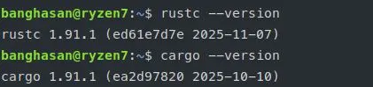
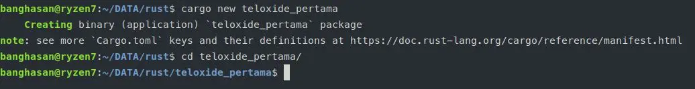
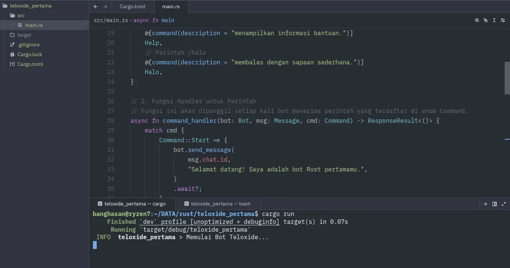
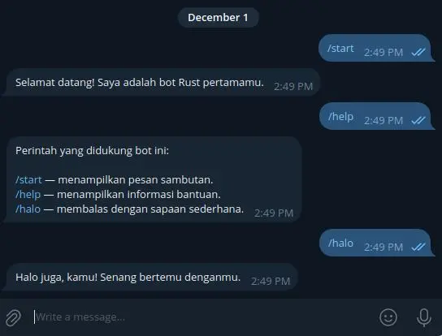

```admonish bug
Buku ini masih *draft*, kemungkinan akan mengalami banyak errornya baik dipraktekkan maupun susunan materinya.
```


# MEMBANGUN BOT TELEGRAM DENGAN RUST DAN TELOXIDE

## Pengantar

Selamat datang di panduan komprehensif untuk membangun bot Telegram yang cepat, aman, dan andal menggunakan bahasa pemrograman **Rust** dan *framework* **Teloxide**.

Jika kamu adalah seorang pemula yang baru mengenal Rust atau pengembangan bot, jangan khawatir. E-book ini dirancang untuk memandumu langkah demi langkah, mulai dari instalasi dasar hingga implementasi fitur-fitur canggih. Jika kamu sudah memiliki pengalaman, e-book ini akan membantumu memahami bagaimana Teloxide memanfaatkan kekuatan Rust untuk menciptakan bot yang luar biasa.

### Mengapa Rust untuk Bot Telegram?

Rust adalah bahasa pemrograman yang berfokus pada dua hal utama: **kecepatan** dan **keamanan memori**.

*   **Performa Tinggi:** Rust dikompilasi menjadi kode mesin, yang berarti bot kamu akan berjalan sangat cepat, setara dengan C atau C++. Ini sangat penting untuk bot yang menangani banyak permintaan secara bersamaan.
*   **Keamanan:** Rust menjamin keamanan memori tanpa *garbage collector*, mencegah *bug* umum seperti *null pointer dereference* atau *data race* saat menggunakan *multithreading*. Bot kamu akan lebih stabil dan minim *crash*.
*   **Ekosistem Asinkron yang Kuat:** Rust memiliki ekosistem asinkron (`async/await`) yang matang, sempurna untuk operasi I/O-berat seperti berkomunikasi dengan API Telegram.

---

## Bagian I: Persiapan dan Dasar-Dasar Rust

Bagian ini akan memandumu dalam menyiapkan lingkungan pengembangan dan mempelajari dasar-dasar bahasa Rust yang diperlukan sebelum kita terjun ke Teloxide.

### Bab 1: Instalasi Rust dan Lingkungan Pengembangan

Untuk memulai, kamu perlu menginstal Rust. Cara termudah dan paling direkomendasikan adalah melalui **`rustup`**, alat manajemen versi Rust.

#### Langkah 1: Menginstal `rustup`

Buka terminal (di Linux/macOS) atau PowerShell/Command Prompt (di Windows).

**Untuk Linux dan macOS:**

Jalankan perintah berikut:

```bash
curl --proto '=https' --tlsv1.2 -sSf https://sh.rustup.rs | sh
```

Setelah instalasi selesai, kamu mungkin perlu me-muat ulang *shell* kamu atau menjalankan perintah berikut untuk memastikan `cargo` (manajer paket Rust) ada di *PATH* sistem kamu:

```bash
source $HOME/.cargo/env
```

**Untuk Windows:**

1.  Kunjungi situs resmi `rustup`: [https://rustup.rs/](https://rustup.rs/).
2.  Unduh dan jalankan *installer* `rustup-init.exe`.
3.  Ikuti instruksi di layar. Biasanya, kamu bisa memilih opsi instalasi default (pilihan `1`).
4.  Pastikan kamu juga telah menginstal *build tools* C++ untuk Visual Studio, yang diperlukan Rust untuk mengkompilasi kode. *Installer* Rust biasanya akan memandumu untuk menginstalnya.

#### Langkah 2: Verifikasi Instalasi

Setelah instalasi, verifikasi bahwa Rust dan `cargo` telah terinstal dengan benar dengan menjalankan perintah:

```bash
rustc --version
cargo --version
```



Jika kamu melihat nomor versi, selamat! Lingkungan Rust kamu sudah siap.

### Bab 2: Proyek Rust Pertama dengan Cargo

Semua proyek Rust modern dikelola oleh **Cargo**, manajer paket dan sistem *build* resmi Rust.

#### Membuat Proyek Baru

Mari kita buat proyek Rust pertama kita, yang akan kita sebut `hello_rust`:

```bash
cargo new hello_rust
cd hello_rust
```

Perintah ini akan membuat direktori `hello_rust` dengan struktur dasar:

```
hello_rust/
├── Cargo.toml
└── src/
    └── main.rs
```

*   **`Cargo.toml`**: File konfigurasi proyek. Di sinilah kamu mendefinisikan dependensi (pustaka/ *crate*) dan metadata proyek.
*   **`src/main.rs`**: Berisi kode sumber utama aplikasi kamu.

#### Menjalankan Proyek

Buka `src/main.rs`. Kamu akan melihat kode "Hello, World!" standar:

```rust
fn main() {
    println!("Hello, world!");
}
```

```admonish info
Kamu bisa menjalankan contoh source code untuk pelajaran Rust dasar dengan mengklik tombol Run (pojok kanan atas, disamping tombol `copy`)
```


Untuk mengkompilasi dan menjalankan proyek, gunakan:

```bash
cargo run
```

Kamu akan melihat *output*: `Hello, world!`.

#### Membangun Proyek

Jika kamu hanya ingin mengkompilasi kode tanpa menjalankannya, gunakan:

```bash
cargo build
```

*Executable* yang dihasilkan akan berada di direktori `target/debug/`.

### Bab 3: Dasar-Dasar Bahasa Rust (Tutorial Singkat)

Sebelum kita masuk ke Teloxide, mari kita pahami beberapa konsep dasar Rust.

#### 3.1. Variabel dan Mutabilitas

Secara *default*, variabel di Rust bersifat **tidak dapat diubah (*immutable*)**.

```rust
fn main() {
    let x = 5; // x immutable
    println!("Nilai x adalah: {}", x);

    // x = 6; // ERROR! Kamu tidak bisa mengubah variabel immutable

    let mut y = 5; // Tambahkan 'mut' untuk membuatnya mutable
    println!("Nilai y sebelum diubah: {}", y);
    y = 6; // OK
    println!("Nilai y setelah diubah: {}", y);
}
```

#### 3.2. Tipe Data Dasar

Rust adalah bahasa yang diketik secara statis (*statically typed*), tetapi seringkali dapat menyimpulkan tipe data.

| Tipe Data | Deskripsi | Contoh |
| :--- | :--- | :--- |
| **Integer** | Bilangan bulat (i8, u8, i32, u32, i64, u64, dll.) | `let a: i32 = 42;` |
| **Floating-Point** | Bilangan desimal (f32, f64) | `let b: f64 = 3.14;` |
| **Boolean** | Benar atau salah | `let c: bool = true;` |
| **Char** | Karakter Unicode tunggal | `let d: char = '🦀';` |
| **String** | Teks (ada dua jenis utama: `&str` dan `String`) | `let s = "Halo";` |

#### 3.3. Struktur Kontrol: `if` dan `match`

Rust menggunakan `if` seperti bahasa lain, tetapi juga memiliki ekspresi `match` yang sangat kuat.

```rust
fn main() {
    let angka = 7;

    // Contoh if/else
    if angka < 5 {
        println!("Angka kecil");
    } else if angka == 7 {
        println!("Angka keberuntungan!");
    } else {
        println!("Angka besar");
    }

    // Contoh match (sangat umum di Rust)
    let status_kode = 200;
    match status_kode {
        200 => println!("OK"),
        404 => println!("Tidak Ditemukan"),
        500 => println!("Kesalahan Server"),
        _ => println!("Status tidak diketahui"), // _ adalah wildcard
    }
}
```

#### 3.4. Fungsi

Fungsi didefinisikan dengan kata kunci `fn`.

```rust
// Fungsi tanpa nilai kembalian
fn sapa_kamu(nama: &str) {
    println!("Halo, {}!", nama);
}

// Fungsi dengan nilai kembalian (ditentukan setelah ->)
fn tambah_dua(x: i32) -> i32 {
    x + 2 // Ekspresi tanpa titik koma (;) adalah nilai kembalian
}

fn main() {
    sapa_kamu("Budi");
    let hasil = tambah_dua(10);
    println!("10 + 2 = {}", hasil);
}
```

#### 3.5. Konsep Kunci: Ownership (Kepemilikan)

*Ownership* adalah fitur unik Rust yang menjamin keamanan memori. Ini adalah konsep yang paling sulit bagi pemula, tetapi memahaminya adalah kunci untuk menulis kode Rust yang baik.

**Aturan Dasar Ownership:**

1.  Setiap nilai di Rust memiliki variabel yang disebut **pemilik (*owner*)**.
2.  Hanya ada **satu pemilik** pada satu waktu.
3.  Ketika pemilik keluar dari *scope*, nilai akan **dihapus (*dropped*)**.

**Contoh Sederhana:**

```rust
fn main() {
    let s1 = String::from("halo"); // s1 adalah pemilik String "halo"
    let s2 = s1; // KEPEMILIKAN PINDAH (MOVE) dari s1 ke s2. s1 tidak valid lagi!

    // println!("s1: {}", s1); // ERROR! s1 sudah tidak valid

    println!("s2: {}", s2); // OK
}
```

Untuk menghindari *move* dan hanya menggunakan nilai tanpa mengambil kepemilikan, kita menggunakan **Referensi dan Peminjaman (*References and Borrowing*)**.

```rust
fn hitung_panjang(s: &String) -> usize { // Menerima referensi (&String)
    s.len()
} // s keluar dari scope, tetapi karena itu hanya referensi, tidak ada yang dihapus

fn main() {
    let s1 = String::from("Teloxide");
    let panjang = hitung_panjang(&s1); // Kita meminjam (&) s1
    println!("Panjang '{}' adalah {}", s1, panjang); // s1 masih valid!
}
```

Konsep ini akan menjadi lebih jelas saat kita mulai menulis kode bot. Untuk saat ini, cukup ketahui bahwa Rust sangat ketat tentang siapa yang memiliki data dan kapan data itu dapat diakses.

---

**Sampai di sini, kamu sudah memiliki dasar yang kuat untuk melanjutkan ke pengembangan bot Telegram!**

**Bagian II** akan membahas cara mendapatkan *token* bot dan mulai menggunakan *crate* Teloxide.

---

## Bagian II: Memulai dengan Teloxide


Sekarang kita akan mulai membangun bot Telegram pertama kita. Kita akan menggunakan **Teloxide**, *framework* yang kuat dan mudah digunakan untuk Rust.

### Bab 4: Persiapan Bot Telegram dan Proyek Teloxide

#### 4.1. Mendapatkan Token Bot dari BotFather


Setiap bot Telegram membutuhkan sebuah *token* unik untuk berinteraksi dengan API Telegram. Kamu bisa mendapatkannya dari **BotFather**, bot resmi Telegram.

1.  Buka Telegram dan cari **`@BotFather`**.
2.  Ketik `/newbot` dan ikuti instruksi.
3.  Pilih nama untuk bot kamu (misalnya, "Bot Rust Keren").
4.  Pilih *username* untuk bot kamu (harus diakhiri dengan "bot", misalnya, "rust_keren_bot").
5.  BotFather akan memberimu sebuah *token* yang terlihat seperti ini: `1234567890:ABC-DEF1234ghIkl-zyx57W2v1u123456`. **Simpan *token* ini dengan aman!** Ini adalah kunci bot kamu.


#### 4.2. Membuat Proyek Teloxide Baru

Kita akan membuat proyek baru bernama `teloxide_pertama`.

```bash
cargo new teloxide_pertama
```

ketika dijalankan akan tampil seperti ini:
```sh
$ cargo new teloxide_pertama
    Creating binary (application) `teloxide_pertama` package
note: see more `Cargo.toml` keys and their definitions at https://doc.rust-lang.org/cargo/reference/manifest.html
```

Kemudian masuk ke direktori tersebut:

```sh
cd teloxide_pertama
```



Buka menggunakan editor favoritmu, misalnya VS Code, Sublime, Zed, atau lainnya.

```bash
$ zed .
```
```admonish tip
Saya menggunakan Zed[^zed] untuk editor, karena lebih ringan.
```

#### 4.3. Menambahkan Dependensi

Buka file `Cargo.toml` dan tambahkan dependensi yang diperlukan di bagian `[dependencies]`. Kita membutuhkan `teloxide` dan `tokio` (runtime asinkron yang digunakan Teloxide).

```toml
# teloxide_pertama/Cargo.toml

[package]
name = "teloxide_pertama"
version = "0.1.0"
edition = "2024"

[dependencies]
# Teloxide: Framework bot Telegram
teloxide = { version = "0.17.0", features = ["macros"] }

# Tokio: Runtime asinkron
tokio = { version =  "1.8", features = ["rt-multi-thread", "macros"] }

# Log: Untuk logging yang lebih baik (opsional, tapi direkomendasikan)
log = "0.4"
pretty_env_logger = "0.5"
```

```admonish tip
**Catatan:** Pastikan kamu menggunakan versi yang stabil. Versi di atas mungkin sudah usang saat kamu membaca ini, tetapi konsepnya tetap sama. 

Saat ini ditulis, sudah menggunakan versi terbaru. 

`-- Desember 2025`
```

### Bab 5: Bot "Hello World" Teloxide

Sekarang, mari kita tulis kode bot paling sederhana.

#### 5.1. Kode Bot Dasar


```admonish failure title="Pasti Gagal"
Jangan di run di sini, pasti akan error.

Jalankan pada komputer / vps kamu.
```

Buka `src/main.rs` dan ganti isinya dengan kode berikut:

```rust
// src/main.rs

use log::info;
use teloxide::{prelude::*, utils::command::BotCommands};

// 1. Definisikan Perintah Bot
// Kita menggunakan macro BotCommands dari Teloxide untuk mendefinisikan perintah
// yang akan kita tangani.
#[derive(BotCommands, Clone)]
#[command(
    rename_rule = "lowercase",
    description = "Perintah yang didukung bot ini:"
)]
enum Command {
    // Perintah /start
    #[command(description = "menampilkan pesan sambutan.")]
    Start,
    // Perintah /help
    #[command(description = "menampilkan informasi bantuan.")]
    Help,
    // Perintah /halo
    #[command(description = "membalas dengan sapaan sederhana.")]
    Halo,
}

// 2. Fungsi Handler untuk Perintah
// Fungsi ini akan dipanggil setiap kali bot menerima perintah yang terdaftar di enum Command.
async fn command_handler(bot: Bot, msg: Message, cmd: Command) -> ResponseResult<()> {
    match cmd {
        Command::Start => {
            bot.send_message(
                msg.chat.id,
                "Selamat datang! Saya adalah bot Rust pertamamu.",
            )
            .await?;
        }
        Command::Help => {
            // BotCommands::descriptions() akan menghasilkan daftar semua perintah
            bot.send_message(msg.chat.id, Command::descriptions().to_string())
                .await?;
        }
        Command::Halo => {
            bot.send_message(msg.chat.id, "Halo juga, kamu! Senang bertemu denganmu.")
                .await?;
        }
    }

    Ok(())
}

// 3. Fungsi Utama (Main)
#[tokio::main] // Gunakan macro tokio::main untuk menjalankan fungsi async
async fn main() {
    // Inisialisasi logger
    pretty_env_logger::init();
    info!("Memulai Bot Teloxide...");

    // Mendapatkan token bot dari environment variable
    // Ini adalah cara yang aman untuk menyimpan token
    let bot = Bot::from_env();

    // Dispatcher: Mekanisme utama Teloxide untuk menerima dan memproses update
    // Filter hanya pesan yang mengandung command dan arahkan ke handler yang kita definisikan.
    let handler = Update::filter_message()
        .filter_command::<Command>()
        .endpoint(command_handler);

    Dispatcher::builder(bot, handler)
        .enable_ctrlc_handler() // Memungkinkan bot berhenti dengan Ctrl+C
        .build()
        .dispatch() // Mulai mendengarkan update
        .await;
}

```

#### 5.2. Menjalankan Bot

Untuk menjalankan bot, kamu perlu mengatur *token* bot sebagai *environment variable*.

**Di Linux/macOS:**

Ganti `YOUR_BOT_TOKEN` dengan *token* yang kamu dapatkan dari BotFather.

```bash
export TELOXIDE_TOKEN="YOUR_BOT_TOKEN"
cargo run
```

**Di Windows (PowerShell):**

```powershell
$env:TELOXIDE_TOKEN="YOUR_BOT_TOKEN"
cargo run
```

```admonish question
Jika keluar error seperti ini:

    thread 'main' (124428) panicked at /home/banghasan/.cargo/registry/src/index.crates.io-1949cf8c6b5b557f/teloxide-core-0.13.0/src/bot.rs:319:43:
    Cannot get the TELOXIDE_TOKEN env variable
    note: run with `RUST_BACKTRACE=1` environment variable to display a backtrace
  
Artinya, kamu belum measukkan TOKEN BOT dengan command `export TELOXIDE_TOKEN="YOUR_BOT_TOKEN"`
```

Setelah kamu menjalankan `cargo run`, kamu akan melihat *output* log seperti: `INFO [teloxide_pertama] Memulai Bot Teloxide...`.

```admonish tip
Jalankan Log muncul info pada shell, ketikkan command ini: `export RUST_LOG=info`
```



Sekarang, buka Telegram, cari bot kamu, dan coba kirim perintah:
*   `/start`
*   `/help`
*   `/halo`



Selamat! Kamu telah berhasil membuat dan menjalankan bot Telegram pertamamu dengan Rust dan Teloxide.

```admonish danger
=== SAMPAI SINI DULU VERIFIKASINYA ===
```

### Bab 6: Menangani Pesan Teks Biasa dan State

Bot tidak hanya merespons perintah. Bot juga harus bisa merespons pesan teks biasa dan, yang lebih penting, mengingat *state* (keadaan) pengguna.


#### 6.1. Menangani Pesan Teks Biasa

Kita perlu memodifikasi *dispatcher* untuk menangani semua jenis pesan, bukan hanya perintah.

Ganti bagian `dptree::entry()` di `main` dengan ini:

```rust
// teloxide_pertama/src/main.rs (Modifikasi di fungsi main)

// ... (Kode sebelumnya)

async fn handle_message(bot: Bot, msg: Message) -> ResponseResult<()> {
    // Jika pesan adalah perintah, biarkan command_handler yang menanganinya
    if let Ok(cmd) = msg.parse_as_command::<Command>() {
        command_handler(bot, msg, cmd).await?;
        return Ok(());
    }

    // Jika bukan perintah, tangani sebagai pesan teks biasa
    if let Some(text) = msg.text() {
        let balasan = format!("Kamu bilang: \"{}\". Coba ketik /help untuk melihat perintah.", text);
        bot.send_message(msg.chat.id, balasan).await?;
    }

    Ok(())
}

#[tokio::main]
async fn main() {
    pretty_env_logger::init();
    info!("Memulai Bot Teloxide...");

    let bot = Bot::from_env();

    // Dispatcher sekarang akan memproses SEMUA pesan
    Dispatcher::builder(bot, dptree::entry().branch(Update::filter_message().endpoint(handle_message)))
        .enable_ctrlc_handler()
        .build()
        .dispatch()
        .await;
}
```

**Penjelasan:**
*   Kita membuat fungsi *handler* baru `handle_message` yang menerima `Message`.
*   Di dalam `handle_message`, kita mencoba mem-*parsing* pesan sebagai perintah. Jika berhasil, kita panggil `command_handler`.
*   Jika gagal, kita anggap itu adalah pesan teks biasa dan membalasnya.
*   *Dispatcher* kini menggunakan `dptree::entry().branch(Update::filter_message().endpoint(handle_message))` untuk mengarahkan semua *update* pesan ke fungsi `handle_message`.

#### 6.2. Menangani State Pengguna (FSM - Finite State Machine)

Untuk bot yang lebih kompleks (misalnya, bot kuis, bot pendaftaran), kamu perlu melacak *state* pengguna. Teloxide sangat mendukung pola **FSM (*Finite State Machine*)** melalui *crate* `dptree`.

**Studi Kasus: Bot Pendaftaran Nama**

Kita akan membuat bot yang meminta nama pengguna, menunggu balasan, dan kemudian menyimpan nama tersebut.

**Langkah 1: Definisikan State**

Tambahkan *crate* `std::sync::Arc` dan `std::collections::HashMap` di bagian `use` dan definisikan *state* di luar `main`.

```rust
// teloxide_pertama/src/main.rs (Tambahkan di bagian atas)
use std::{sync::Arc, collections::HashMap};
use teloxide::dispatching::dialogue::{InMemStorage, Dialogue};

// Definisikan State (Keadaan) yang mungkin
#[derive(Clone, Default)]
pub enum State {
    #[default]
    Start, // State awal
    WaitingForName, // State setelah bot meminta nama
}

// Definisikan Tipe Dialogue
type MyDialogue = Dialogue<State, InMemStorage<State>>;
type HandlerResult = Result<(), Box<dyn std::error::Error + Send + Sync>>;
```

**Langkah 2: Modifikasi Handler**

Kita akan membuat *handler* baru yang menggunakan *dialogue* (state).

```rust
// Handler untuk perintah /register
async fn register_command(bot: Bot, dialogue: MyDialogue, msg: Message) -> HandlerResult {
    bot.send_message(msg.chat.id, "Siapa nama kamu?").await?;
    dialogue.update(State::WaitingForName).await?;
    Ok(())
}

// Handler untuk pesan teks biasa yang bergantung pada state
async fn handle_text(bot: Bot, dialogue: MyDialogue, msg: Message, text: String) -> HandlerResult {
    match dialogue.get().await? {
        State::Start => {
            bot.send_message(msg.chat.id, "Saya tidak mengerti. Coba ketik /register untuk memulai pendaftaran.").await?;
        }
        State::WaitingForName => {
            bot.send_message(msg.chat.id, format!("Terima kasih, {}! Nama kamu sudah saya simpan.", text)).await?;
            dialogue.update(State::Start).await?; // Kembali ke state awal
        }
    }
    Ok(())
}
```

**Langkah 3: Modifikasi Dispatcher**

Kita perlu mengaktifkan *dialogue* di *dispatcher* dan mengatur *routing* berdasarkan *state*.

```rust
// teloxide_pertama/src/main.rs (Modifikasi di fungsi main)

#[tokio::main]
async fn main() {
    pretty_env_logger::init();
    info!("Memulai Bot Teloxide...");

    let bot = Bot::from_env();

    // Inisialisasi storage untuk dialogue (InMemStorage berarti disimpan di memori)
    let storage = InMemStorage::<State>::new();

    // Dispatcher dengan Dialogue
    Dispatcher::builder(
        bot,
        dptree::entry()
            // 1. Ambil Dialogue
            .enter_dialogue::<Update, InMemStorage<State>, State>()
            // 2. Cabang untuk Perintah
            .branch(
                Update::filter_message()
                    .filter_command::<Command>()
                    .endpoint(register_command), // Hanya /register yang kita tangani di sini
            )
            // 3. Cabang untuk Pesan Teks (berdasarkan state)
            .branch(
                Update::filter_message()
                    .filter_text()
                    .endpoint(handle_text),
            ),
    )
    .dependencies(dptree::deps![storage]) // Masukkan storage sebagai dependency
    .enable_ctrlc_handler()
    .build()
    .dispatch()
    .await;
}

// Catatan: Kamu perlu memodifikasi enum Command untuk menyertakan Register
#[derive(BotCommands, Clone)]
#[command(rename_rule = "lowercase", description = "Perintah yang didukung bot ini:")]
enum Command {
    // ... (Perintah sebelumnya)
    #[command(description = "memulai proses pendaftaran nama.")]
    Register,
}

// Hapus command_handler lama dan ganti dengan yang baru (atau gabungkan)
// Untuk kesederhanaan, kita hanya fokus pada /register dan handle_text
// Pastikan kamu menghapus atau mengganti command_handler lama agar tidak terjadi konflik.
// Untuk e-book ini, kita akan fokus pada pola FSM yang baru.
```

Dengan pola FSM ini, bot kamu dapat mengingat langkah mana dalam percakapan yang sedang diikuti pengguna, memungkinkan alur interaksi yang jauh lebih kompleks dan terstruktur.

---

**Bagian III** akan membawa kita ke fitur-fitur lanjutan, termasuk *inline keyboard* dan studi kasus yang lebih menarik.

---

## Bagian III: Fitur Lanjutan dan Studi Kasus Menarik

Setelah menguasai dasar-dasar, mari kita eksplorasi fitur-fitur yang membuat bot Telegram menjadi interaktif dan kuat.

### Bab 7: Membuat Bot Interaktif dengan Inline Keyboard

**Inline Keyboard** adalah tombol yang muncul tepat di bawah pesan bot, bukan di area input teks. Ini sangat berguna untuk membuat menu interaktif, survei, atau konfirmasi tindakan.

#### 7.1. Konsep Dasar Inline Keyboard

Setiap tombol *inline* memiliki dua bagian penting:
1.  **Teks:** Teks yang terlihat oleh pengguna.
2.  **`callback_data`:** Data tersembunyi yang dikirim kembali ke bot saat tombol ditekan.

**Studi Kasus: Bot Pemilih Warna Favorit**

Kita akan membuat bot yang menawarkan tiga pilihan warna dan merespons berdasarkan pilihan pengguna.

**Langkah 1: Definisikan Callback Data**

Kita akan menggunakan *enum* untuk mendefinisikan data yang akan dikirim kembali. Ini adalah praktik terbaik di Rust.

```rust
// teloxide_pertama/src/main.rs (Tambahkan di bagian atas)
use serde::{Deserialize, Serialize};
use teloxide::types::{InlineKeyboardMarkup, InlineKeyboardButton};

// Definisikan data yang akan dikirim saat tombol ditekan
#[derive(Debug, Clone, Copy, Serialize, Deserialize)]
enum CallbackData {
    PilihWarna(Warna),
}

#[derive(Debug, Clone, Copy, Serialize, Deserialize)]
enum Warna {
    Merah,
    Biru,
    Hijau,
}
```

**Langkah 2: Fungsi Pembuat Keyboard**

Buat fungsi yang menghasilkan *inline keyboard*.

```rust
fn buat_keyboard() -> InlineKeyboardMarkup {
    let tombol_merah = InlineKeyboardButton::callback(
        "Merah",
        serde_json::to_string(&CallbackData::PilihWarna(Warna::Merah)).unwrap(),
    );
    let tombol_biru = InlineKeyboardButton::callback(
        "Biru",
        serde_json::to_string(&CallbackData::PilihWarna(Warna::Biru)).unwrap(),
    );
    let tombol_hijau = InlineKeyboardButton::callback(
        "Hijau",
        serde_json::to_string(&CallbackData::PilihWarna(Warna::Hijau)).unwrap(),
    );

    // Kita buat keyboard dengan satu baris berisi tiga tombol
    InlineKeyboardMarkup::new(vec![vec![tombol_merah, tombol_biru, tombol_hijau]])
}
```

**Langkah 3: Handler untuk Mengirim Keyboard**

Tambahkan perintah baru `/warna` dan *handler*-nya.

```rust
// Tambahkan /warna ke enum Command
// ...
    #[command(description = "meminta kamu memilih warna favorit.")]
    Warna,
// ...

// Handler untuk perintah /warna
async fn warna_command(bot: Bot, msg: Message) -> HandlerResult {
    bot.send_message(msg.chat.id, "Pilih warna favoritmu:")
        .reply_markup(buat_keyboard()) // Lampirkan keyboard
        .await?;
    Ok(())
}
```

**Langkah 4: Handler untuk Callback Query**

Ini adalah bagian terpenting. Ketika pengguna menekan tombol, bot menerima `CallbackQuery`, bukan `Message`. Kita perlu *handler* terpisah untuk ini.

```rust
async fn callback_handler(bot: Bot, q: CallbackQuery) -> HandlerResult {
    // Pastikan ada data callback
    let data = q.data.ok_or_else(|| "Callback query tanpa data")?;

    // Deserialisasi data JSON kembali ke enum CallbackData
    let callback_data: CallbackData = serde_json::from_str(&data)?;

    // Ambil ID chat dan ID pesan asli
    let chat_id = q.message.as_ref().map(|m| m.chat.id).unwrap_or_default();
    let message_id = q.message.as_ref().map(|m| m.id).unwrap_or_default();

    match callback_data {
        CallbackData::PilihWarna(warna) => {
            let balasan = format!("Pilihanmu adalah: {:?}. Terima kasih!", warna);

            // 1. Edit pesan asli untuk menunjukkan hasil
            bot.edit_message_text(chat_id, message_id, balasan)
                .await?;

            // 2. Kirim notifikasi pop-up (opsional)
            bot.answer_callback_query(q.id)
                .text(format!("Kamu memilih {:?}", warna))
                .await?;
        }
    }

    Ok(())
}
```

**Langkah 5: Modifikasi Dispatcher untuk Callback Query**

Kita perlu menambahkan cabang baru di *dispatcher* untuk menangani `CallbackQuery`.

```rust
// teloxide_pertama/src/main.rs (Modifikasi di fungsi main)

#[tokio::main]
async fn main() {
    // ... (Kode inisialisasi)

    Dispatcher::builder(
        bot,
        dptree::entry()
            // Cabang untuk Message (perintah dan teks)
            .branch(
                Update::filter_message()
                    .branch(dptree::entry().filter_command::<Command>().endpoint(warna_command)) // Tambahkan handler /warna
                    // ... (Tambahkan handler perintah lain di sini)
            )
            // Cabang BARU untuk CallbackQuery
            .branch(Update::filter_callback_query().endpoint(callback_handler)),
    )
    // ... (Dependencies dan dispatch)
}
```

Dengan *inline keyboard*, kamu telah meningkatkan interaktivitas bot kamu secara signifikan!

### Bab 8: Studi Kasus Lanjutan: Bot Pengingat Sederhana

Untuk menunjukkan kekuatan *async* Rust dan Teloxide, mari kita buat bot yang dapat mengirim pengingat setelah beberapa detik.

#### 8.1. Konsep Asinkron dan `tokio::time::sleep`

Karena Rust menggunakan model asinkron, kita dapat "tidur" (*sleep*) tanpa memblokir seluruh bot.

**Langkah 1: Tambahkan Perintah Pengingat**

Tambahkan perintah `/ingatkan <waktu_detik> <pesan>` ke `enum Command`.

```rust
// ...
    #[command(description = "mengirim pengingat setelah beberapa detik.", parse_with = "split")]
    Ingatkan {
        waktu_detik: u64,
        pesan: String,
    },
// ...
```

**Langkah 2: Handler Pengingat**

```rust
use std::time::Duration;

async fn ingatkan_command(bot: Bot, msg: Message, waktu_detik: u64, pesan: String) -> HandlerResult {
    let chat_id = msg.chat.id;

    bot.send_message(chat_id, format!("Oke, saya akan mengingatkanmu dalam {} detik.", waktu_detik)).await?;

    // Ini adalah kunci: kita menggunakan tokio::time::sleep
    // Bot akan "tidur" di sini, tetapi thread utama tidak akan terblokir.
    tokio::time::sleep(Duration::from_secs(waktu_detik)).await;

    // Setelah tidur, kirim pesan pengingat
    bot.send_message(chat_id, format!("🔔 PENGINGAT: {}", pesan)).await?;

    Ok(())
}
```

**Langkah 3: Modifikasi Dispatcher**

Pastikan `ingatkan_command` ditambahkan ke cabang perintah di *dispatcher*.

```rust
// teloxide_pertama/src/main.rs (Modifikasi di fungsi main)

// ...
            .branch(
                Update::filter_message()
                    .filter_command::<Command>()
                    .endpoint(|bot: Bot, msg: Message, cmd: Command| async move {
                        match cmd {
                            Command::Warna => warna_command(bot, msg).await,
                            Command::Ingatkan { waktu_detik, pesan } => ingatkan_command(bot, msg, waktu_detik, pesan).await,
                            // ... (Perintah lain)
                            _ => Ok(()),
                        }
                    })
            )
// ...
```

Dengan studi kasus ini, kamu telah melihat bagaimana Rust dan Teloxide menangani tugas-tugas asinkron dengan elegan, yang merupakan fondasi untuk bot yang lebih kompleks seperti bot penjadwalan atau bot yang melakukan *polling* API eksternal.

---

**Bagian IV** akan membahas integrasi basis data, yang merupakan langkah penting untuk bot yang perlu menyimpan data secara permanen.

---

## Bagian IV: Persistensi Data dengan SQLite

Bot yang berguna harus mampu menyimpan data. Kita akan menggunakan **SQLite**, basis data ringan yang sangat cocok untuk aplikasi bot karena tidak memerlukan server terpisah. Kita akan menggunakan *crate* **`sqlx`** yang merupakan ORM (Object-Relational Mapper) asinkron yang modern untuk Rust.

### Bab 9: Integrasi `sqlx` dan SQLite

#### 9.1. Menambahkan Dependensi

Buka `Cargo.toml` dan tambahkan dependensi berikut. Perhatikan bahwa kita perlu mengaktifkan fitur `runtime-tokio-rustls` dan `sqlite` untuk `sqlx`.

```toml
# teloxide_pertama/Cargo.toml

[dependencies]
# ... (Dependensi sebelumnya)

# SQLx: ORM asinkron untuk Rust
sqlx = { version = "0.7", features = ["runtime-tokio-rustls", "sqlite", "macros"] }
dotenvy = "0.15" # Untuk memuat environment variable dari file .env
```

#### 9.2. Setup Database dan Migrasi

`sqlx` memerlukan *tool* `sqlx-cli` untuk menjalankan migrasi (pembuatan skema tabel).

**Langkah 1: Instal `sqlx-cli`**

```bash
cargo install sqlx-cli
```

**Langkah 2: Buat File `.env`**

Buat file `.env` di *root* proyek kamu untuk menyimpan *path* ke basis data SQLite.

```
# .env
DATABASE_URL=sqlite:bot_data.db
```

**Langkah 3: Buat Migrasi**

Kita akan membuat tabel sederhana untuk menyimpan catatan (seperti *to-do list*).

```bash
sqlx migrate add create_notes_table
```

Perintah ini akan membuat direktori `migrations/` dan sebuah file dengan *timestamp* di dalamnya. Buka file tersebut (misalnya, `migrations/20251201000000_create_notes_table.sql`) dan isi dengan skema tabel:

```sql
-- Up migration
CREATE TABLE notes (
    id INTEGER PRIMARY KEY AUTOINCREMENT,
    chat_id BIGINT NOT NULL,
    content TEXT NOT NULL,
    created_at DATETIME NOT NULL DEFAULT CURRENT_TIMESTAMP
);

-- Down migration
DROP TABLE notes;
```

**Langkah 4: Jalankan Migrasi**

```bash
cargo sqlx migrate run
```

Ini akan membuat file `bot_data.db` dan tabel `notes` di dalamnya.

#### 9.3. Koneksi Database ke Bot

Kita perlu membuat *pool* koneksi basis data dan menyediakannya sebagai *dependency* untuk *handler* bot.

**Langkah 1: Modifikasi `main.rs`**

Tambahkan *use* yang diperlukan dan *load* `.env`.

```rust
// teloxide_pertama/src/main.rs (Tambahkan di bagian atas)
use sqlx::{SqlitePool, migrate::Migrator};
use dotenvy::dotenv;
use std::path::Path;

// ... (use lainnya)

// Definisikan tipe Pool
type DbPool = SqlitePool;

// ... (Kode lainnya)

#[tokio::main]
async fn main() -> Result<(), Box<dyn std::error::Error>> {
    dotenv().ok(); // Muat file .env
    pretty_env_logger::init();
    info!("Memulai Bot Teloxide...");

    let bot = Bot::from_env();

    // 1. Inisialisasi Pool Koneksi Database
    let database_url = std::env::var("DATABASE_URL")
        .expect("DATABASE_URL harus diatur di .env");

    let pool = SqlitePool::connect(&database_url).await?;

    // 2. Jalankan Migrasi (opsional, tapi bagus untuk memastikan skema terbaru)
    // Ini akan menjalankan migrasi yang belum diterapkan
    Migrator::new(Path::new("./migrations"))
        .await?
        .run(&pool)
        .await?;

    // ... (Dispatcher setup)

    // Masukkan pool sebagai dependency
    Dispatcher::builder(
        bot,
        dptree::entry()
            // ... (Cabang-cabang lainnya)
    )
    .dependencies(dptree::deps![pool]) // Masukkan pool di sini
    .enable_ctrlc_handler()
    .build()
    .dispatch()
    .await;

    Ok(())
}
```

### Bab 10: Implementasi CRUD+List

Kita akan membuat bot yang dapat menyimpan, melihat, memperbarui, dan menghapus catatan.

#### 10.1. Definisikan Perintah CRUD

Tambahkan perintah berikut ke `enum Command`:

```rust
// ...
    #[command(description = "menambahkan catatan baru.", parse_with = "split")]
    Tambah { content: String },
    #[command(description = "melihat semua catatan.")]
    List,
    #[command(description = "memperbarui catatan berdasarkan ID.", parse_with = "split")]
    Update { id: i64, content: String },
    #[command(description = "menghapus catatan berdasarkan ID.")]
    Hapus { id: i64 },
// ...
```

#### 10.2. Handler untuk CREATE (Tambah)

```rust
async fn tambah_note(bot: Bot, msg: Message, pool: DbPool, content: String) -> HandlerResult {
    let chat_id = msg.chat.id.0; // Ambil ID chat sebagai i64

    sqlx::query!(
        "INSERT INTO notes (chat_id, content) VALUES (?, ?)",
        chat_id,
        content
    )
    .execute(&pool)
    .await?;

    bot.send_message(msg.chat.id, "✅ Catatan berhasil ditambahkan!").await?;
    Ok(())
}
```

#### 10.3. Handler untuk READ (List)

```rust
// Struktur untuk memetakan hasil query
#[derive(Debug)]
struct Note {
    id: i64,
    content: String,
    created_at: String,
}

async fn list_notes(bot: Bot, msg: Message, pool: DbPool) -> HandlerResult {
    let chat_id = msg.chat.id.0;

    let notes = sqlx::query_as!(
        Note,
        "SELECT id, content, created_at FROM notes WHERE chat_id = ? ORDER BY id DESC",
        chat_id
    )
    .fetch_all(&pool)
    .await?;

    if notes.is_empty() {
        bot.send_message(msg.chat.id, "Kamu belum punya catatan. Coba /tambah <catatanmu>.").await?;
        return Ok(());
    }

    let mut response = String::from("📝 **Daftar Catatanmu:**\n\n");

    for note in notes {
        response.push_str(&format!("**ID:** `{}`\n**Isi:** {}\n*Dibuat: {}*\n\n",
            note.id,
            note.content,
            note.created_at.split('.').next().unwrap_or(&note.created_at) // Hapus milidetik
        ));
    }

    bot.send_message(msg.chat.id, response)
        .parse_mode(teloxide::types::ParseMode::Markdown)
        .await?;

    Ok(())
}
```

#### 10.4. Handler untuk UPDATE

```rust
async fn update_note(bot: Bot, msg: Message, pool: DbPool, id: i64, content: String) -> HandlerResult {
    let chat_id = msg.chat.id.0;

    let result = sqlx::query!(
        "UPDATE notes SET content = ? WHERE id = ? AND chat_id = ?",
        content,
        id,
        chat_id
    )
    .execute(&pool)
    .await?;

    if result.rows_affected() > 0 {
        bot.send_message(msg.chat.id, format!("✅ Catatan ID `{}` berhasil diperbarui.", id)).await?;
    } else {
        bot.send_message(msg.chat.id, format!("❌ Catatan ID `{}` tidak ditemukan atau bukan milikmu.", id)).await?;
    }

    Ok(())
}
```

#### 10.5. Handler untuk DELETE (Hapus)

```rust
async fn hapus_note(bot: Bot, msg: Message, pool: DbPool, id: i64) -> HandlerResult {
    let chat_id = msg.chat.id.0;

    let result = sqlx::query!(
        "DELETE FROM notes WHERE id = ? AND chat_id = ?",
        id,
        chat_id
    )
    .execute(&pool)
    .await?;

    if result.rows_affected() > 0 {
        bot.send_message(msg.chat.id, format!("✅ Catatan ID `{}` berhasil dihapus.", id)).await?;
    } else {
        bot.send_message(msg.chat.id, format!("❌ Catatan ID `{}` tidak ditemukan atau bukan milikmu.", id)).await?;
    }

    Ok(())
}
```

#### 10.6. Mengintegrasikan Handler ke Dispatcher

Terakhir, kita perlu menambahkan *handler* CRUD ini ke *dispatcher* utama.

```rust
// teloxide_pertama/src/main.rs (Modifikasi di fungsi main)

// ... (Di dalam Dispatcher::builder)

            .branch(
                Update::filter_message()
                    .filter_command::<Command>()
                    .endpoint(|bot: Bot, msg: Message, cmd: Command, pool: DbPool| async move {
                        match cmd {
                            // ... (Perintah sebelumnya)
                            Command::Tambah { content } => tambah_note(bot, msg, pool, content).await,
                            Command::List => list_notes(bot, msg, pool).await,
                            Command::Update { id, content } => update_note(bot, msg, pool, id, content).await,
                            Command::Hapus { id } => hapus_note(bot, msg, pool, id).await,
                            _ => Ok(()),
                        }
                    })
            )
// ...
```

Dengan implementasi ini, bot kamu kini memiliki kemampuan untuk menyimpan data secara permanen, menjadikannya aplikasi yang jauh lebih fungsional dan canggih.

---

## Bagian V: Penutup dan Sumber Belajar

### Bab 11: Kesimpulan dan Langkah Selanjutnya

Selamat! Kamu telah menyelesaikan perjalanan dari instalasi Rust hingga membangun bot Telegram yang canggih dengan Teloxide dan integrasi basis data SQLite.

Kamu telah mempelajari:
*   Dasar-dasar Rust, termasuk *ownership* dan *mutability*.
*   Cara menyiapkan proyek Teloxide dan menggunakan `cargo`.
*   Implementasi bot "Hello World" dan penanganan perintah.
*   Penggunaan **Finite State Machine (FSM)** untuk mengelola *state* percakapan.
*   Membuat antarmuka interaktif dengan **Inline Keyboard**.
*   Mengintegrasikan basis data **SQLite** menggunakan `sqlx` untuk operasi **CRUD+List**.

Bot yang kamu buat ini adalah fondasi yang kuat. Dari sini, kamu bisa mengembangkan bot yang lebih kompleks, seperti bot manajemen grup, bot *e-commerce* sederhana, atau bot yang berinteraksi dengan API eksternal lainnya.

### Bab 12: Referensi dan Sumber Belajar Tambahan

Perjalanan belajar tidak berhenti di sini. Berikut adalah beberapa sumber daya penting yang dapat kamu gunakan untuk memperdalam pengetahuanmu tentang Rust dan Teloxide.

| Sumber Daya | Deskripsi | Tautan |
| :--- | :--- | :--- |
| **The Rust Programming Language (Book)** | "Buku Rust" resmi. Sumber terbaik untuk mempelajari Rust secara mendalam. | [https://doc.rust-lang.org/book/](https://doc.rust-lang.org/book/) |
| **Teloxide Documentation** | Dokumentasi resmi Teloxide. Sangat detail dan memiliki banyak contoh. | [https://docs.rs/teloxide/](https://docs.rs/teloxide/) |
| **SQLx Documentation** | Dokumentasi resmi *crate* `sqlx`. Penting untuk memahami fitur basis data asinkron. | [https://docs.rs/sqlx/](https://docs.rs/sqlx/) |
| **Rust by Example** | Belajar Rust melalui contoh-contoh kode yang dapat kamu jalankan. | [https://doc.rust-lang.org/rust-by-example/](https://doc.rust-lang.org/rust-by-example/) |
| **Asynchronous Programming in Rust** | Panduan untuk memahami konsep `async/await` di Rust. | [https://rust-lang.github.io/async-book/](https://rust-lang.github.io/async-book/) |

Semoga e-book ini menjadi panduan yang berharga dalam petualanganmu membangun bot Telegram dengan Rust! Selamat berkarya!

[^zed]: <https://zed.dev/> is a minimal code editor crafted for speed and collaboration with humans and AI
