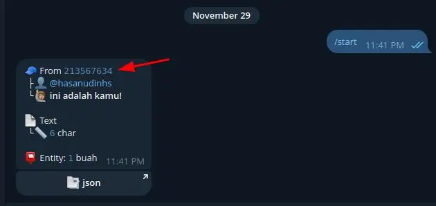

# Notifikasi Login VPS ke Telegram dengan Bash dan cURL

Tutorial ini akan memandu Anda langkah demi langkah untuk membuat sebuah skrip sederhana yang akan mengirimkan notifikasi ke akun Telegram Anda setiap kali ada pengguna yang berhasil login ke server (VPS) melalui SSH. Ini adalah cara yang bagus untuk memonitor aktivitas login dan meningkatkan keamanan server Anda.

---

### Langkah 1: Membuat Bot Telegram


Untuk mengirim pesan melalui API Telegram, kita memerlukan sebuah bot.

1.  Buka aplikasi Telegram Anda, cari akun bernama `BotFather` (ada tanda centang biru).
2.  Mulai percakapan dengan `BotFather` dengan mengetik `/start`.
3.  Buat bot baru dengan mengetik perintah `/newbot`.
4.  `BotFather` akan meminta Anda untuk memberikan nama untuk bot Anda (misalnya: "VPS Monitor").
5.  Selanjutnya, berikan username untuk bot Anda. Username harus unik dan diakhiri dengan kata `bot` (misalnya: `vps_monitor_xyz_bot`).
6.  Setelah berhasil, `BotFather` akan memberikan Anda sebuah **Token API**. Token ini sangat rahasia dan digunakan untuk mengontrol bot Anda.


Salin dan simpan token ini di tempat yang aman. Kita akan menggunakannya di dalam skrip.

**CATATAN PENTING:** Jaga kerahasiaan Token API Anda. Siapa pun yang memilikinya dapat mengendalikan bot Anda.

---

### Langkah 2: Mendapatkan Chat ID Anda

Setelah bot dibuat, kita perlu tahu kemana pesan notifikasi akan dikirim. Setiap pengguna atau grup di Telegram memiliki `Chat ID` yang unik.

1.  Di aplikasi Telegram Anda, cari username bot yang baru saja Anda buat.
2.  Mulai percakapan dengan bot Anda dengan menekan tombol **Start** atau mengirim pesan apa pun (misalnya: "halo").
3.  Sekarang, buka terminal di VPS Anda (atau komputer lokal yang memiliki `curl`) dan jalankan perintah berikut. Ganti `<TOKEN_BOT_ANDA>` dengan Token API yang Anda dapatkan dari `BotFather`.

    ```bash
    curl "https://api.telegram.org/bot<TOKEN_BOT_ANDA>/getUpdates"
    ```

4.  Anda akan melihat respons dalam format JSON. Cari bagian `result` -> `message` -> `chat` -> `id`. Itulah `Chat ID` Anda.

    ```json
    {
      "ok": true,
      "result": [
        {
          "update_id": 834572275,
          "message": {
            "message_id": 1,
            "from": {
              "id": 123456789, // Ini adalah Chat ID Anda
              "is_bot": false,
              "first_name": "Nama",
              "last_name": "Anda",
              "username": "usernameAnda",
              "language_code": "en"
            },
            "chat": {
              "id": 123456789, // Pastikan untuk menyalin ID ini
              "first_name": "Nama",
              "last_name": "Anda",
              "username": "usernameAnda",
              "type": "private"
            },
            "date": 1672531200,
            "text": "halo"
          }
        }
      ]
    }
    ```
Atau bisa didapatkan di bot [@strukturbot](https://t.me/strukturbot)
    

    
Salin dan simpan `ID` / `Chat ID` Anda.

---

### Langkah 3: Membuat Skrip Bash Notifikasi

Sekarang kita akan membuat skrip `bash` yang akan mengirim notifikasi.

1.  Buat file baru di direktori yang Anda inginkan, misalnya `/usr/local/bin/notif-login.sh`.

    ```bash
    sudo nano /usr/local/bin/notif-login.sh
    ```

2.  Salin dan tempel kode berikut ke dalam file tersebut.

    ```bash
    #!/bin/bash

    # --- KONFIGURASI ---
    # Ganti dengan Token API bot Telegram Anda
    TOKEN="<GANTI_DENGAN_TOKEN_ANDA>"
    # Ganti dengan Chat ID Anda
    CHAT_ID="<GANTI_DENGAN_CHAT_ID_ANDA>"
    # --- SELESAI KONFIGURASI ---

    # Mendapatkan informasi login
    # PAM_USER adalah username yang login
    # PAM_RHOST adalah alamat IP dari mana user login
    # PAM_TYPE adalah jenis sesi (misal: "sshd", "login")
    USER_LOGIN="${PAM_USER}"
    IP_ADDRESS="${PAM_RHOST}"
    LOGIN_TYPE="${PAM_TYPE}"
    HOSTNAME=$(hostname)

    # Format pesan notifikasi (menggunakan format Markdown)
    MESSAGE=$(printf "🚨 *Notifikasi Login SSH di %s*\n\n*Username:* \`%s\`\n*Dari IP:* \`%s\`\n*Jenis Sesi:* \`%s\`\n*Waktu:* \`%s\`" \
        "$HOSTNAME" \
        "$USER_LOGIN" \
        "$IP_ADDRESS" \
        "$LOGIN_TYPE" \
        "$(date '+%d-%m-%Y %H:%M:%S')")

    # URL API Telegram untuk mengirim pesan
    URL="https://api.telegram.org/bot${TOKEN}/sendMessage"

    # Mengirim notifikasi menggunakan curl
    # -s : silent mode, tidak menampilkan progress bar
    # -d : data yang dikirim (payload)
    # parse_mode=Markdown : agar format tebal, miring, dll bisa ditampilkan
    curl -s -d "chat_id=${CHAT_ID}&text=${MESSAGE}&parse_mode=Markdown" "${URL}" > /dev/null
    ```

3.  **Penting:** Ganti nilai `TOKEN` dan `CHAT_ID` dengan milik Anda.
4.  Simpan file tersebut (di `nano`, tekan `Ctrl+X`, lalu `Y`, lalu `Enter`).

---

### Langkah 4: Membuat Skrip Menjadi Executable

Agar skrip bisa dijalankan, kita perlu memberikan izin eksekusi.

```bash
sudo chmod +x /usr/local/bin/notif-login.sh
```

---


### Langkah 5: Menjalankan Skrip Secara Otomatis Saat Login

Cara terbaik untuk memicu skrip ini saat ada login SSH adalah dengan menggunakan PAM (Pluggable Authentication Modules).

1.  Buka file konfigurasi PAM untuk SSH.

    ```bash
    sudo nano /etc/pam.d/sshd
    ```

2.  Tambahkan baris berikut di **akhir** file. Baris ini akan memberitahu PAM untuk menjalankan skrip kita setiap kali sesi SSH berhasil dibuka.

    ```
    # Menjalankan skrip notifikasi Telegram saat sesi login dibuka
    session    optional     pam_exec.so /usr/local/bin/notif-login.sh
    ```

    *   `session`: Menandakan bahwa ini berjalan pada tahap sesi.
    *   `optional`: Jika skrip gagal, proses login tetap diizinkan. Ini penting agar Anda tidak terkunci dari server jika ada kesalahan pada skrip.
    *   `pam_exec.so`: Modul PAM yang digunakan untuk mengeksekusi perintah eksternal.

3.  Simpan dan tutup file.

---


### Langkah 6: Uji Coba

Selesai! Sekarang mari kita uji.

1.  Logout dari sesi SSH Anda saat ini.
2.  Login kembali ke VPS Anda.
3.  Dalam beberapa detik, Anda akan menerima notifikasi di Telegram dari bot yang telah Anda buat!

Pesan notifikasinya akan terlihat seperti ini:

> 🚨 *Notifikasi Login SSH di nama-vps-anda*
>
> *Username:* `root`
> *Dari IP:* `123.123.123.123`
> *Jenis Sesi:* `sshd`
> *Waktu:* `29-11-2025 10:30:00`

Selamat, Anda telah berhasil meningkatkan keamanan server Anda dengan notifikasi login real-time!
